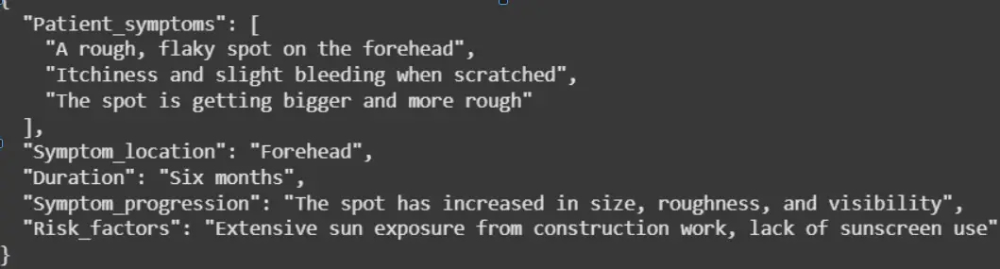

#Meeting #GP/meeting

## The Goals :

1. track the last progress in model summarization ai , and flutter application .
    

---

## Model Summarization Ai .

- All Done
    

### What the model do ?

[Colab Link](https://colab.research.google.com/drive/1S1S8MNpOQTtgE8XX6rlA2-jVkp4Rttf-?usp=sharing)

  

- receive the json file (contain the conversation between patient and chatbot  )
    
- translate it from Arabic to English
    
- summarize the content depend on pydantic Schema
    

### Sample result :

  

---

## Flutter Application

### what we will do  ?

1. Native Splash (- , - )
    
2. Onboarding ( - ,logic )
    
3. Standardize the color palette of the application - 🔴
    
4. use the same api files - 🔴
    
5. link our files with each other - 🔴
    
6. login page (UI , Logic )
    
7. Sign up page (UI , - )
    
8. Forget password page (UI , - )
    
9. OTP page (UI , - )
    
10. QR code page (UI , - )
    
11. Chatbot page (UI , - )
    
12. Appointment page ( - , - )
    
13. doctor page (- , - )
    
14. Add filter ( - , - )
    

  

---

### Problems

1. handle reset password separate resetOtp from email and password.
    

  
**