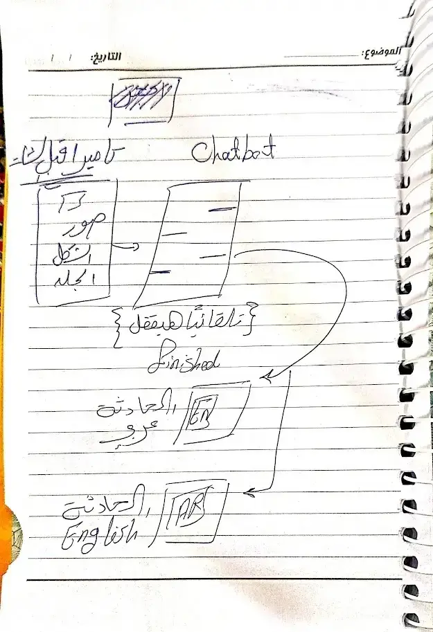
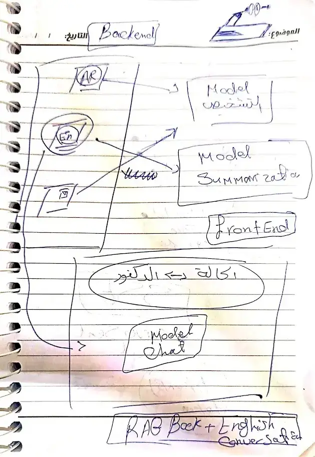
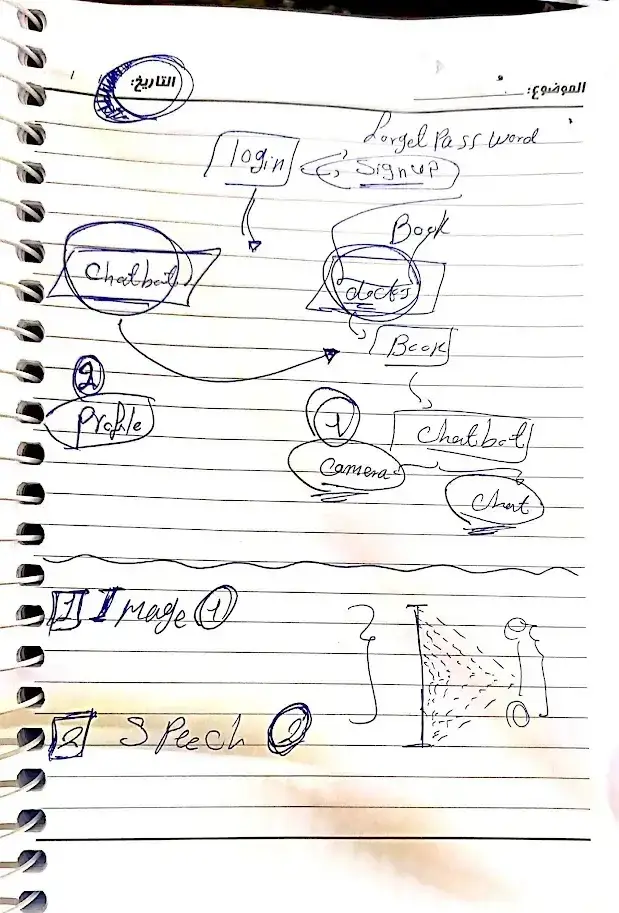

- NLP Tasks 
	- translate the code of translated task from my colab notebook to diaa colab (pydantic class , template , generate)
	- create an api endpoint (translate endpoint)
- Flutter Tasks
	- flutter profile page 
	- flutter register  
	- flutter camera before chatbot 

---
> project flow 

[[GP project Flow.canvas|GP project Flow]]

