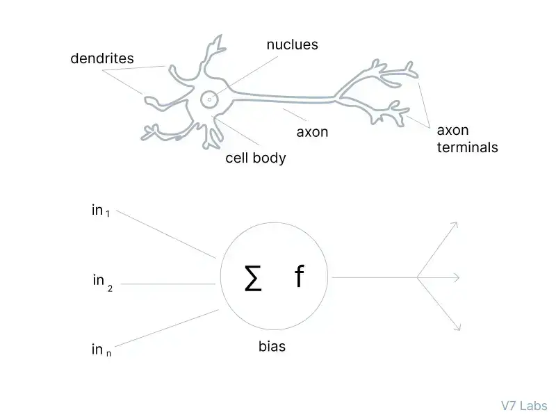
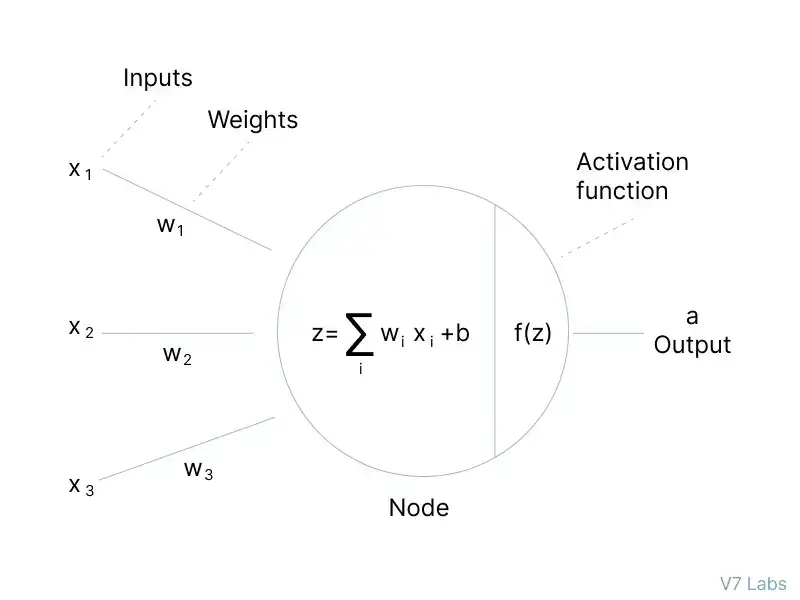
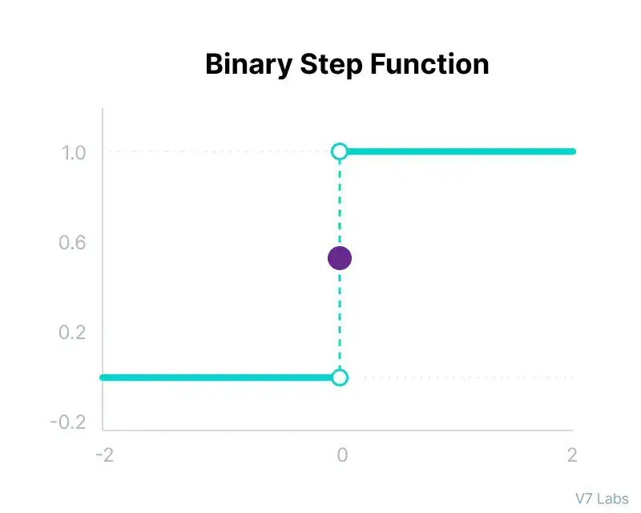
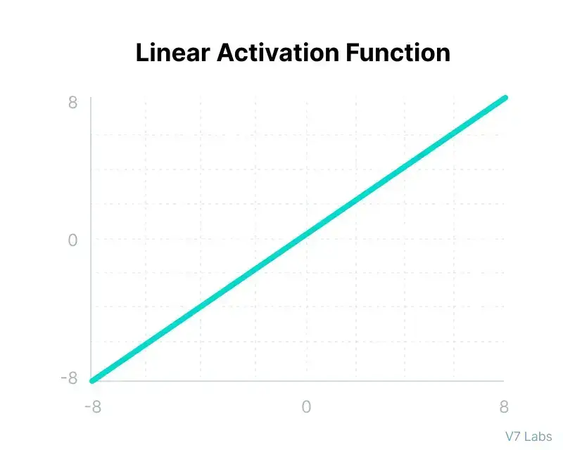
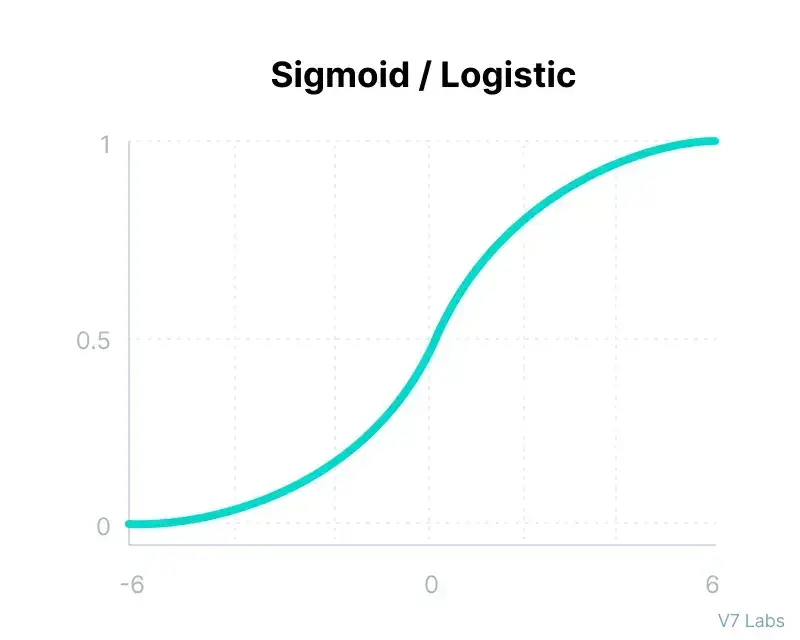

---
---
#ml_and_dnn 

## what is Activation function ? 
- بتساعد ال Neural Network في تعميق فهم و استخدام المعلومات المهمة و التركيز عليها دون غيرها ، من خلال هي بتحدد ايه المعلومات المهمه و ايه الي غير مهمه . 
- بتؤدي نفس اداء خلايا الدماغ بتشوف المعلومات المهمه و بتحتفظ بيها و غير  المهمه بتنساها  .
- the primary goal of the activation function is transfer the summed weighted input from the node to an output value to be fed to the next hidden layer or as output . 

## Why do Neural Networks Need an Activation Function?
- to add non-linearity to the neural network , to can solve complex problems 
تم شحر الجزء ده في ال non linearity transformation في ال [[Archive/University 1/data_science/data science - summary]] 

## Types of Neural Networks Activation Functions
1. binary step function (greater than is activated else is deactivated ) 
2. linear activation function  (is not possible to apply backpropagation as the derivative of the function)                                                     

## 10 Non-Linear Neural Networks Activation Functions
###### 1.Sigmoid / logistic function 

