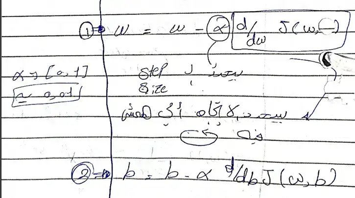
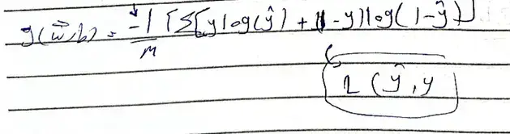
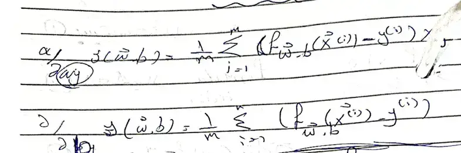

---
---
#ml_and_dnn 
**machine learning : "Field of study that gives computers the ability to learn without begging explicitly " - Arthur Samuel (1959)**

---
# Supervised Machine learning 
we help the machine by provide it the historical data (labels ) . 
## Regression 
predict the number depend on the best line can drawn between points  . 

x -> find the suitable  function with the training set -> prediction (estimate y)
$f(x) = wx +b$
$w,b$: coefficients parameters weights 
### Cost function  
Square Error cost function 
$J(w,b) =  \frac{1}{2m}\sum_{i=1}^m(f_{w,b}(x)^{(i)}-y^{(i)} )^2$
$f_{w,b}(x)^{(i)}: \hat{y}$

the error or different between y& $\hat{y}$ is the **vertical** line between them  . 
و لكن ليس شرط ان يكون هذا الخط الراسمي عمودياً 
### Gradient Descent Algorithm for linear regression 
find the local minimum  
لانك لما تبدأ من مكان مختلف في كل مره هتلاقي نفسك وصلت لقاع (وادي ) مختلف عن الي قبلهم . 

### multiple linear regression (no multivariant regression)
vectorization format that is efficiency in coding 
alternative to gradient descent in linear regression is : **Normal Equation**
that is for any linear regression but slow when the number of features is large (>10,000)
## Classification (logistic regression)

predict the categories (small numbers of possible output (limited)) 
we use logistic function (sigmoid function ) ,because the output between 0 and 1 
**sigmoid function :** $g(z) = \frac{1}{1+e^-z} , 0<g(z)<1$
z = w.x +b 

think in logistic regression like "probability that class A is 1  " 
### cost function 
to calculate the  cost function easy we  , need to make the function of the algorithm to be convex 

### Gradient descent for logistic regression 

## Overfitting & Underfitting 
### underfitting (high bias)
the model doesn't fit  the training set well 

### overfitting (high variance )
the model fit the training set **extremely** well 

#### Addressing overfitting 
1. Getting more data (increase the examples , training data )
2. decrease the Number of features to avoid polynomial function (feature selection)
3. Regularization (we don't regularize b (intercept)) 
	- بيقلل عدد ال features زي الخطوة 2 ، و لكن الفرق انه بدل ما بيشيل ال features بشكل كامل ، بيقلل تأثيره فقط و لكن بيخليه مش بيشيله 

## Regularization 
### Regularization for linear regression 

### Regularization for logistic regression 
# Unsupervised Machine learning 
find something interesting in unlabeled data (find pattern)
## clustering 
group similar data together 
## Anomaly detection
find unusual data points 
## dimensionality Reduction 
compress data using fewer Numbers 