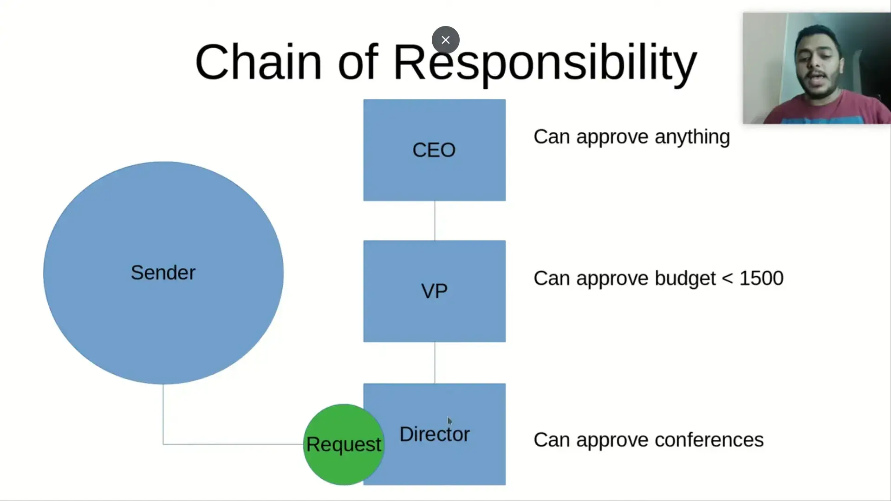

[[Design Pattern]]
#source/Youtube 
#status/complete 

----

Algo 
لو عندي request محتاج يتهندل من المسؤولين ، فبدل ما ابعت لكل المسؤولين الي عندي و ده ممكن يؤدي الي اخطاء زي مثلا انهم كلهم يردوا عليا مره واحده بالموافقه او يبقي فيه مسؤولين مش قادرين يهندلو ال request ده يبقي انا ضيعت resource علي الفاضي ، فبدل كل ده ببعت ال request لل Handler و هو يبدأ يتصرف بمعرفته بحيث إنه بيودي ال request بتاعي للحاجات واحد واحد لحد ما يوصل للشخص الي يقدر يهندل ال request ده ، و لكن انا كـ sender مش عارف و مش فارق معايا مين الي handle الي request . 

pros
decouple between Sender and Handler 
decouple between handling items 
can Extendable 

cons 
when the handling items is large can decrease the performance 