---
---
#ml_and_dnn 
## Reference : 
1. Andrew course - week  1 and 2 
2. [[Activation Function or Transfer Function]]

-----
# Outline 

1. CNN Foundation 
2. the goal of CNN and  important layers 
3. Classic Network
	1. LeNet - 5 
	1. AlexNet 
	1. VGG - 16 
4. ResNet 
5. Inception 
6. MobilNet 
7. EffecientNet 
8. some Notes about CNN 

----
## Convolution Neural Network Foundation
### what is convolution and what is the operations can do on the image before convolution : 

How to apply filters on the original image using convolution multiplication (element wise ) 

#### Why padding ? 
- when using mask to display more and explore the edges in the original image , we sometimes loss that  edges  found in the الحافة ( the most pixel in the image )  , and shrink the image maybe loss the information about the image . 
#### The types of convolution is : 
Valid :  without (padding ) the formula is [ n - f + 1  * n - f + 1 ] 
For example : original image [ 6 * 6 ] * mask (filter ) [ 3 * 3 ] => [ 4 * 4 ] ( 6 -3 + 1 * 6-3 +1 ]  
Same : with Padding => that is mean if the original image size is [ 6 * 6 ] , so the output image size will be [ 6 * 6 ]  => relate the next formula [n+2p-f+1 * n+2p-f+1] 

----

#### Stride convolution 
دي بمثابة ال Jump يعني بدل ما كنت بتحرك حركة واحده (بلوكه واحده ) كل مره ... لأ بحدد رقم معين و ببدأ اتحرك علي اساسه . 
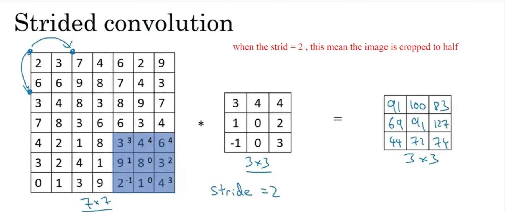
the new formula become : $\frac{n+2p-f}{s} + 1$ *  $\frac{n+2p-f}{s} + 1$ 
و عشان نتجنب جزئية اننا ممكن لما نعمل حركه جديده جزء من المربع الازرق الي في الصورة ممكن يبقي بره اصلا dimension .. هنستخدم ال Floor  عشان لو كان ناتج القسمه رقم فيه كسر .  ^4cc5bd

---
#### convolution in 3D images 
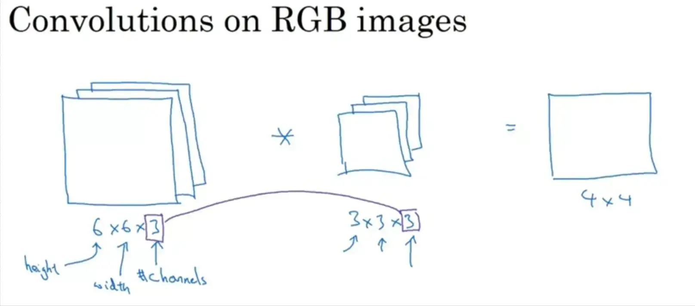

#### Multiple filters 
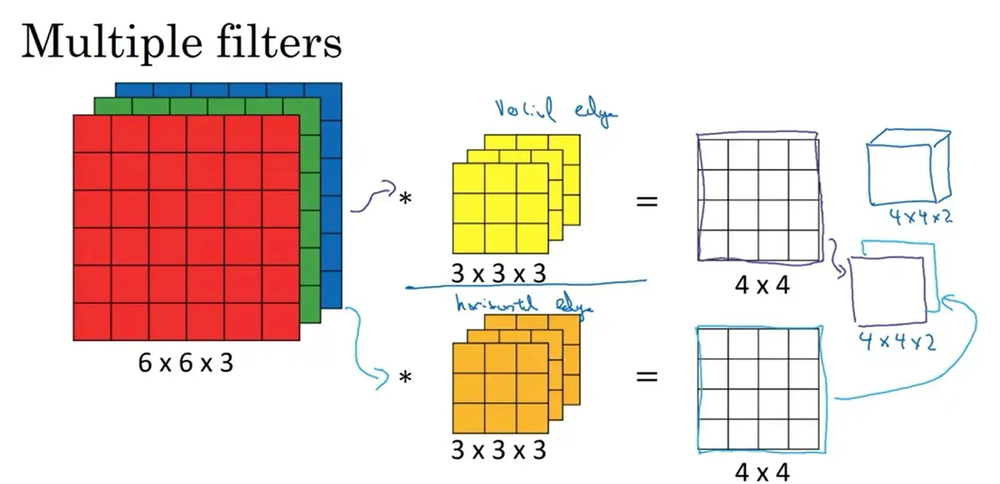

و خلي بالك لازم يكون ال dimension الخاص بال الصورة النهائية علي الشكل التالي : 
[n-f+1 * n-f+1 * nc # number of channel] 

### implement one- layer of convolution Network 
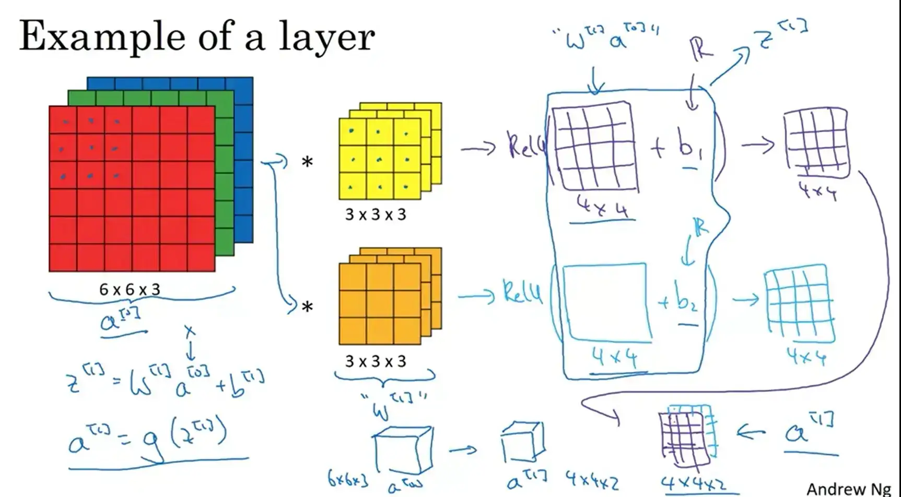
![[Pasted image 20241216232633 1.webp|595]]

Notes that : 
- A[L] : if you use mini-batch technique when training . 

###### The first ConvNet 
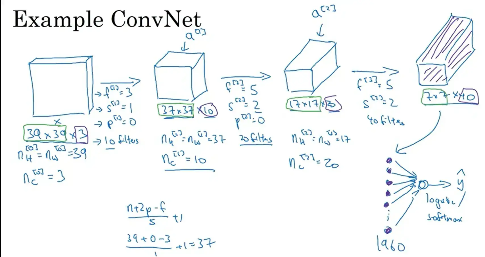

###### Types of layer in Convolutional Network 
1. convolution layer (conv) 
2. Pooling layer (POOL )
3. Fully connected layer (FC)

### Pooling (Fixed function)
![[Pasted image 20241217001831 1.webp|536]]
**Note that : No parameters (No Weights ) to learn ! in pool (not backpropagation)** 
#### Max Pool  
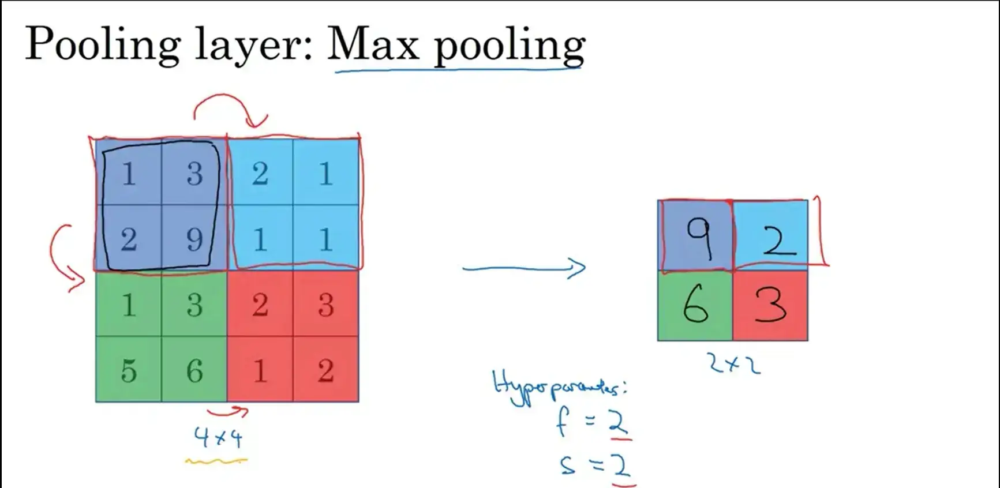

يعتبر نفس فكرة عمل ال convolution الطبيعي و لكن الاضافة في الموضوع في طريقة اخذ ال parameter ( pixel ) في ال convolution كنت بضرب ال filter * image و لكن المره دي انا باخد القيمة الاعلي في المربع الي بحدده . 

#### Average pool 
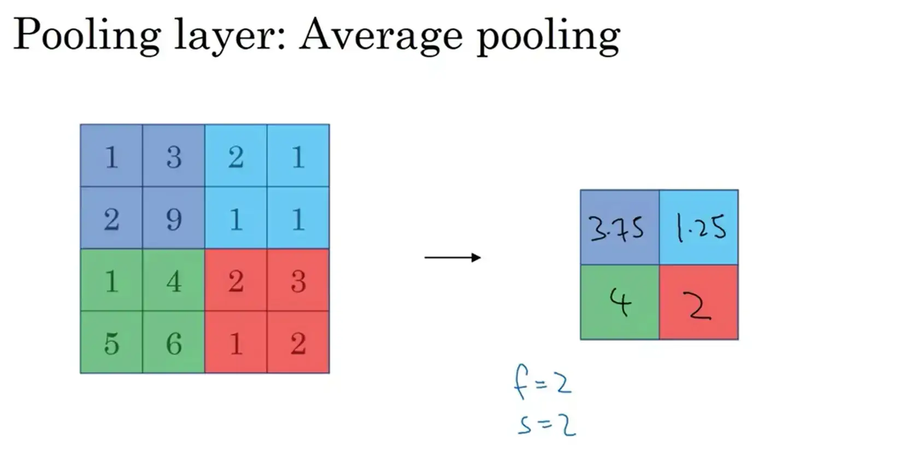

----
#### convolution Neural Network Example 

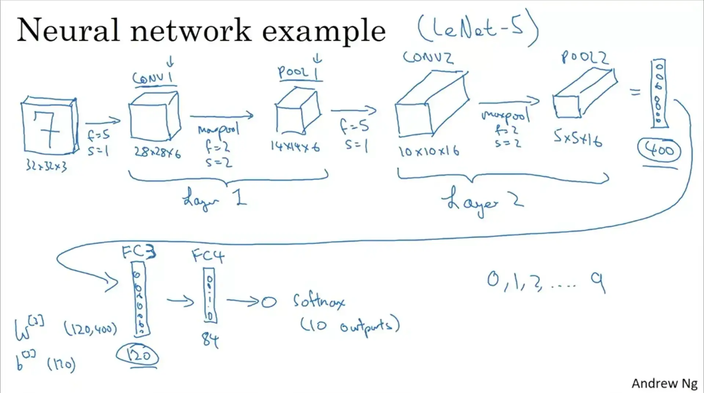

**the common pattern in  Neural Network**
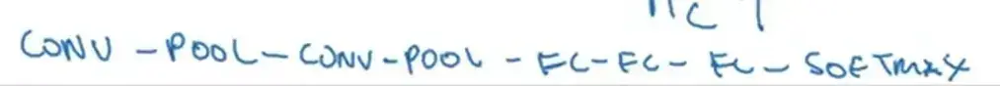

---
### why parameters 
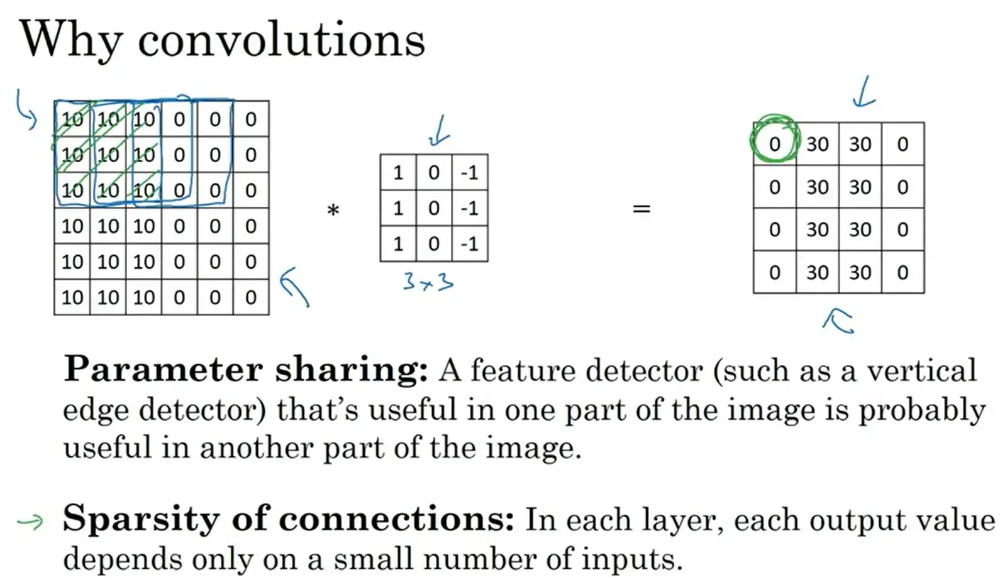

------

## ## the goal of CNN and  important layers 
### convolution layer 
**the main goal of Convolution layers  is feature Extraction** not dimension reduction
### Pooling layer
**the main goal of Pooling layers is dimension Reduction** and we don't apply any kernels (filters) to the input layer , but you must know the pooling layers don't reduce the number of channels , because is work independently on each channel
### flatting layer 
**the main goal of flatting layers is to transfer the feature map into suitable format for feeding into fully connected layers , in an other word restructuring the data into a 1D vector** , by take the feature map and make it a long single vector .
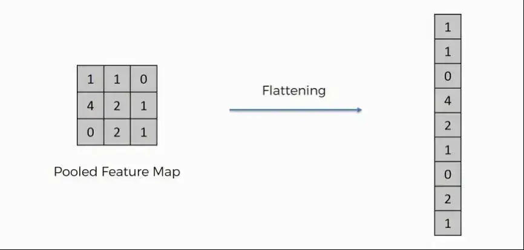

### Dense layer (fully connected layer) 
**the main goal of dense layer is after extract the important feature from input  , we integrate this feature map  into prediction** 

---

## Classic Networks 

### LeNet - 5 

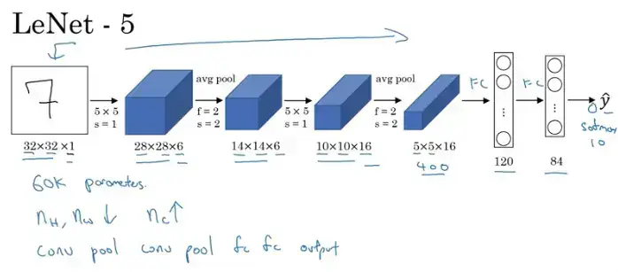
Can understand number of parameters tends to 60,000 

### AlexNet 
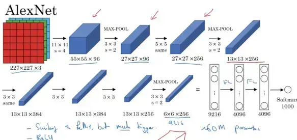
Can understand number of parameters tends to 60 Million 

### VGG - 16  

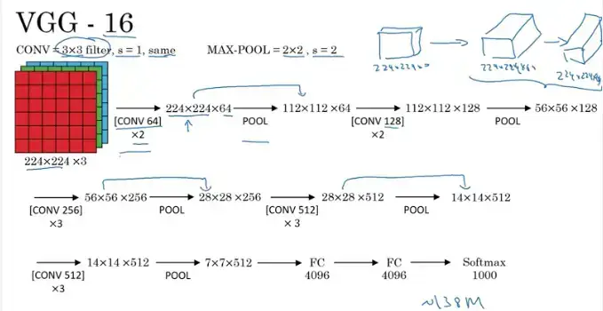
Can understand number of parameters tends to 138 Million 
The feature in this is try to simplify the convolution and pooling networks 
Conv  = 3*3 filter size , s = 1 , same padding | max-pool = 2*2 filter size , s = 2 

---

## ResNet 

ResNet build from Residual block 
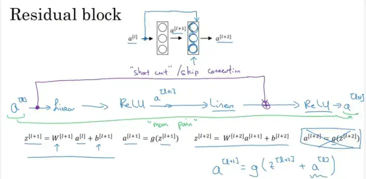
![[Pasted image 20241217230027 1.webp|675]]

لذلك فإن ال resnet ليست مناسبة كثير مع تدريب  الشبكات العميقة جدا جدا ، و لكنها مناسبة مع الشبكات المتوسطة لانها تحسن قليلا من اداءها  لانها لا تتأثر بشكل كبير بال vanshing . 
و في حالة ان ال neural network الطرفين الي بختار من عنده و بنهي من عنده ال skip connection لازم يكونوا علي نفس ال size و لو محصلش كده بضرب ال activation function الي جايه في weight عشان اظبط ال size قبل ما اطبق ال activation function الجديده علي النحو التالي : 
g(w[L+2] * a[L+1] + b[L+2] + w(size) * a[L] ) 

## Inception 
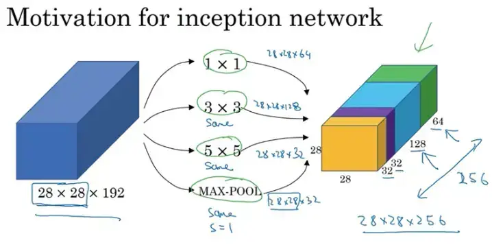
فكرة عمل ال inception هي دمج اكتر من filter علي نفس ال volume ، و لكن ده هيؤدي ال computational cost كبيره جدا و في هذه اللحظة هتظهر اهمية ال convolution 1x1 بحيث اني اعمل shrink و بعدين اجيب الناتج مع كل filter ده طبعا هيقلل من الكفاءة و لكن هيوفر عليا computational cost كبيره  . 
## MobileNet
انشاء Neural Network قابلة للتشغيل علي اجهزة الهاتف  
Key points : 
Depth separable convolution ( depthwise and pointwise ) 

![[Pasted image 20241217230416 1.webp|536]]
ممكن نقول علي النموذج بالشكل ده MobileNet V1 

MobileNet V2 (Bottleneck convolution )  key points 
Add skip connection like in (inception ) 
Add expansion volume 
Depth  separable convolution 
Add projection volume

## EfficientNet 
الفكرة الاساسية منها هو التحكم في كفاءة ال neural network تلقائيا علي حسب امكانيات الجهاز الخاص بيك سواء تلفون او كمبيوتر . 
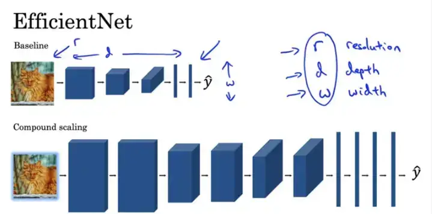
بلعب في القيم الثلاثة دول r , w , d 

----
## DenseNet - 121 

like resnet but , add more connections between  other layers  , this help to avoid vanishing and improve the gradient . 

في ال desneNet انا بعمل concatenate لل layers علي عكس ال ResNet انا بعمل Adding لل layers بتاعتي . 

###### features 
1. Growth Rate (number of features or channels  in each conv layer ) (k = number ) : meaning if you apply 6 conv layer , then 3 * 6 = 18 new feature output 
2. decrease the gradient vanishing (because the each layer has a overall idea about another layer in the Neural Network ) 

---
## some Notes about CNN 
\- when create a filter 3X3 or 5X5 or so on we apply padding to the filter to can match with the original image 
\- there are diff between concatenate and adding layers 
\- Abstract view about complete CNN 
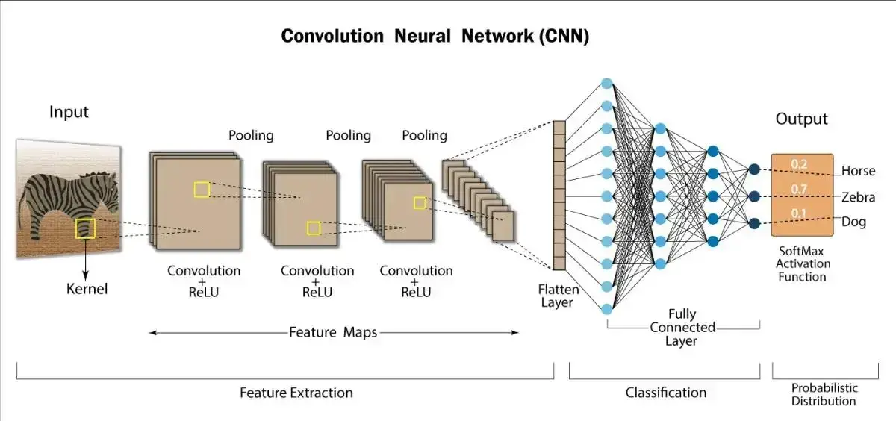

note that : in feature map part , we apply activation function only on convolution layers (after each convolution layer we multiply it with activation function ) , **because the big goal of activation function is learn / include the non-linearity or complex features with feature map** , so depend on it the classification part need also  need activation function 

in activation function (in convolution layer  and fully connect layer ) we commonly use **RELU** (positive values  if output positive , otherwise will be zero ) , that is good solve Vanishing gradient problem  or can use also **Leaky RELU** that is allow small  non-zero gradient to prevent dead neurons during  training 

in activation function (in output layer ) we  common use **Sigmoid** for multi label classification range [0 , 1] and **Softmax**  for multi class classification range [0 , 1 ] and **Tanh** range [-1 , 1]  

\- the simple  meaning of sparse connection  in CNN : 
allow the CNN look the small area or region of the input  at a time 
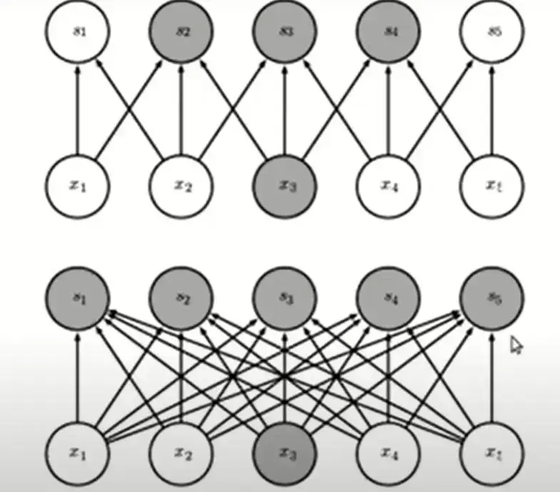

note that : the small regions name **receptive field**.

\- the simple meaning of parameter sharing  in CNN : 
use the same set of weights (filters or kernels ) across all patches .. like use the same stencil for draw the canvas  
this help to extract the same pattern like edge . 

\- the main diff between traditional full connected Networks and convolutional Neural Network is two features : 
1. parameter sharing 
2. sparse connection (local connectivity )
