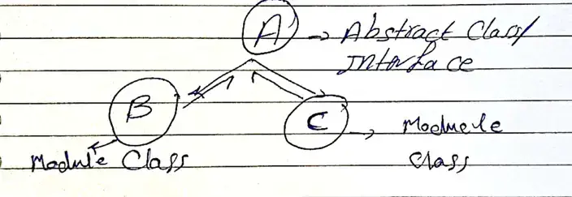

#software #SOLID_principles 
related:: [[Archive/MOCS 1/flutter]]

معناها ان ال High level modules  و ال low level modules المفروض ميعتمدوش علي بعض ، لكن بيعتمدا علي ال Abstraction class 

- يعني اخلي تعامل الكلاس يبقي مع الل Abstract class مش class تاني . 

