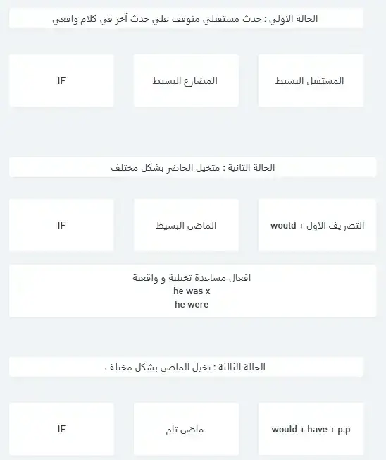

# A - An - The 
## A - An
-  *عدد واحد من* 
- مكرر نكرة 
- مش جمع 
## The 
- الي مش مكرر (معرفة)
- او لو معروف للطرفين 

## Uncountable nouns 
- اسامي لا تعد 
- (milk - cheese - coffee)
- مش بحط قدامها حاجه 
Example: 
- who is the boy with the green shirt. 

---
# in - on - at (pre positions)
## المكان 
in=> مكان واسع in Egypt 
on=> بتحددلي اكتر on Ramsis street  
at=> اكبر دقه ممكن اوصلها 
## الزمان 
in=> الزمان بشكل عام in 1990
on=> on Friday on Friday 
at=> الساعة بالظبط at 5:00 

---
# preset simple (simple present )
هو ايه ؟؟ 
- بتكلم عن صفة (am-is-are)
- بتكلم عن حاجة بتتكرر 
هو مش ايه ؟؟ 
- هو مش حاجة بتحصل حالاً

I do watch a movie every night 

---
# Continuous Present 
هو ايه ؟؟ 
- حاجة بتحصل دلوقتي وقت الكلام . 
- اي فعل متحرك لازم يكون فيه فعل مساعد. 
- (am-is-are) + verb + ing
- (a-e-i-o-u) => run -> running
---
# simple past 
- الحاجة الي حصلت في الماضي في وقت معين في زمان 
- ما بيحبش الحساب (يعني متقولش انا عملت كذا سنة تسعين )
---
# continuous past 
(was + were) + verb + ing 
1. الشيء الذي لا ينتهي بسرعه 
2. بستخدم مع (لما) when 

---
# perfect present
- حدث حصل و لسه منتهاش 
- غامضة مش عارفين وقت حدوثها (الجريمة الكاملة)
- (has + have) + p.p

---
# الفرق ما بين المضارع التام و الماضي البسيط 
الماضي البسيط 
- بيحصل و خلص 
المضارع التام 
- زي البيتزا لما بتسحبها بتمط معاك 
- الخبز حصل حالاً (بيتاكل فريش)
- وقت الجملة حصلت امتي 
Example : 
- she called him five times 
- she has called him five times 

Ever = at any time 
has / have + subject + ever + p.p 

----
# Future simple 
- will + verb (قرار سريع)
- verb to be + going to + verb (خطط مستقبلية)
---
# perfect past 
- لو الجملة فيها حدثين حصلوا في الماضي 
- الحدث الاول (الي حصل و خلص) بتحطه في الماضي التام 
- had + p.p

---
# IF - لو 

----
# modal verbs - الافعال الناقصة 

(can - could - would) + التصريف الاول 

القدرة و الاقتراح 
القدرة (can - could)
- I can hear you 
- I could hear you 
الاقتراح (had better- shall - should - ought to) 
- ought to = مش بتيجي غير مثبته 
- had better  (had better not) = نصيحة شديدة
الطلب و الاذن 
الطلب (will - would) , (can - could)
- اكتر تأدبا 
الاذن (may - might) , (can - could)

التأكيد 

الضرورة و الالزام 
(has to , have to ,have got to , has got to)
- الزام او عتاب اختياري 
(must , must not)
- الزام اجباري 

---
# do vs. make 
Do 
- عمل مش مترتب عليه نتيجة 
- التحدث عن نشاط ولكن مبهم 
- المعني واضح و صريح 
Make 
- إنتاج شيء او مصنوع من شيء 
- القرارات و الترتيبات المستقبلية 

----
# much - a little - many - a few  - a lot of - some - any 

---
# possessive adjective - صفات الملكية 
- my الخاص بي 
- your  الخاص بك 
- his الخاص به 
- her الخاص بها 
- your الخاص بهم 
- our الخاص بنا 
- their الخاص بهم 
- its الخاص به (غير عاقل)
----
# possessive pronouns - ضمائر الملكية 
- mine ملكي 
- yours ملكك
- his ملكه
- hers ملكها  
- its ملكه (غير عاقل)
- ours ملكنا
- yours ملككم 
- theirs ملكهم  
Example:
- this house is mine 
---
# Object pronouns 
- me ما يعود علي 
- you ما يعود عليك 
- him ما يعود عليه 
- her ما يعود عليها 
- it ما يعود عليه (غير عاقل)
- you ما يعود عليكم 
- us ما يعود علينا 
- them ما يعود عليهم 
Example : 
- he loves me 
-----
# Reflexive pronouns 
- my self نفسي 
- your self نفسك 
- him self نفسه 
- her self نفسها 
- it self نفسه (غير عاقل)
- your selves نفسهم  
- our selves نفسنا 
- them selves نفسهم 
---
# when / while 
when 
- when + ماضي مستمر + ماضي بسيط 
while (as or just as )
- while + ماضي بسيط + ماضي مستمر 
- while + ماضي مستمر + ماضي مستمر 
----
# How 
- how many 
- how much 
- how long كم العدد 
- how for كم المسافة 
- how about you ? ما رأيك 
- how will you ? كيف سوف 
- how well do ? ما هي درجة الاتقان 

---
# TO / FOR
To 
- to + المصدر 
- to + reason (السبب)
For 
- for + noun 
- for + purpose 

----
# For / since 
for + المدة الزمنية 
since + بداية المدة الزمنية 