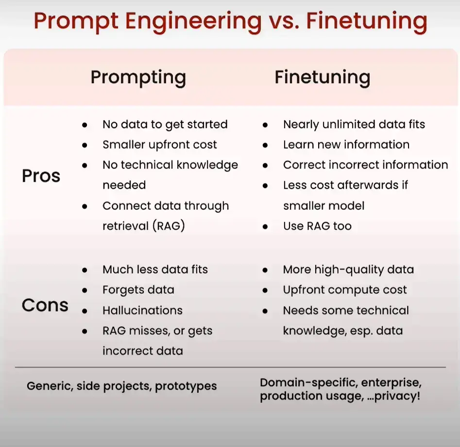

---
---
#NLP #NLP_fine_tuning #llms 

---
course link : https://learn.deeplearning.ai/courses/finetuning-large-language-models/lesson/1/introduction

---
# what is fine tuning  ? 
\- طريقة من اجل تحسين اداء الموديل من خلال اني اديله داتا اكثر تخصص في المجال الي عايز يبقي كويس فيه ، مثلا لو محتاج استخدم chatbot في شركة فمحتاج اديله داتا خاصة بالشركة و معلومات علي الشركة ، customization 

# prompt engineering vs. finetuned ? 
prompt engineering : the art of guiding model behavior to get the best output from the prompt (input )

---
# fine tuning tasks : 

### change behavior 

### Gain knowledge 

### Both 

# what is the diff between finetuning and instruction finetuning ? 

**finetuning:** بيركز اكتر علي انه يفهم التاسك الي متكلف بيه اكتر من اي شيء اخر  ، مثال لو جتله معلومات خاصة بالطب فهو بيركز اكتر انه يفهم المعلومات عن اي شيء اخر 

**instruction finetuning:**  و ده دوره انه يقدر يتعامل مع مساحة مختلفه من المتسخدمين  ، و ده راجع لنوع الداتا الي بياخدها ، نوع الداتا بتبقي عبارة عن معلومات و ارشادات عامة بتديه القدره انه يتعامل مع مساحه مختلفه من المستخدمين و يبقي عنده معرفه عامه في مجالات كتير مش بس في مجال واحد فقط . 

In summary, while both techniques aim to adapt a pretrained model, fine-tuning focuses on improving performance for a specific task using labeled data, whereas instruction fine-tuning is about enhancing the model’s ability to understand and respond to a variety of instructions and tasks.

----
# data prep steps 
1. collect instruction - response pairs 
2. concatenate pairs into prompt template if applicable 
3. tokenize : pad , truncate 
4. split into train/test 

---

----
Notes : 
\- finetuning can be also self-supervised unlabeled data . 
\- extraction : text-in - less text-out (like summarization)  . 
\- expansion : text-in - more text-out (like text generation ) . 
\- overview on finetuning cycle (data prep - change from finetuning type to another - , training  ,  evaluation ) . 
\- Tokenizing data : convert text data into numbers (encoding -> decoding ) . 
\- Padding in Tokenize data prep step mean add paddings (0's) to make the tokenize encoded list have the same length . 
