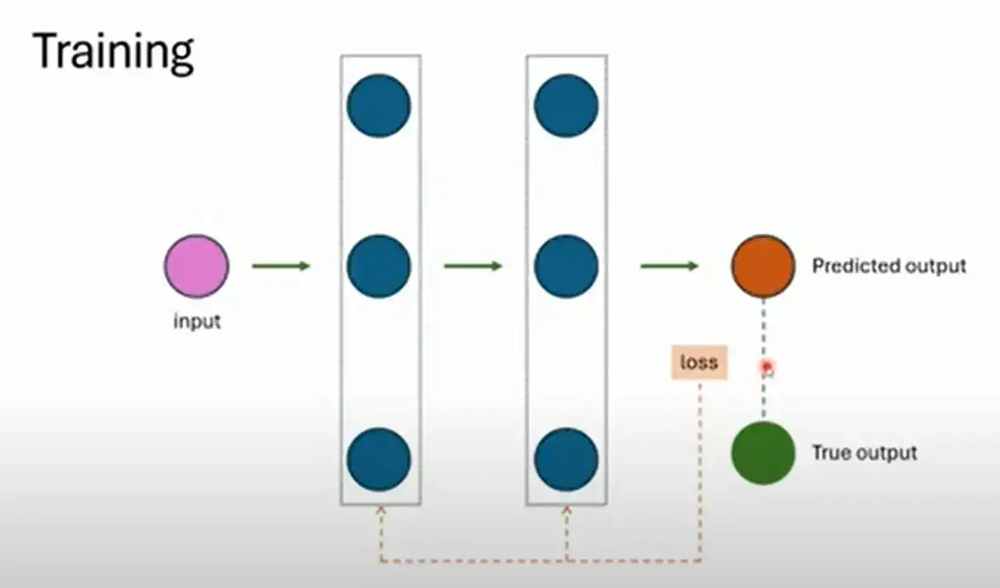
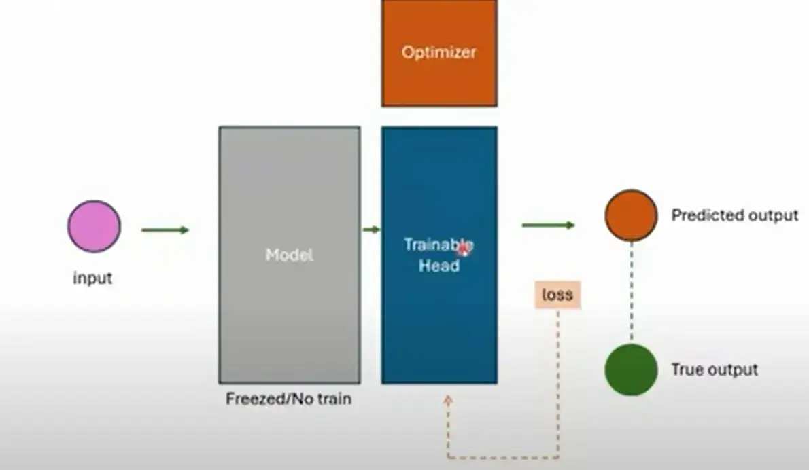
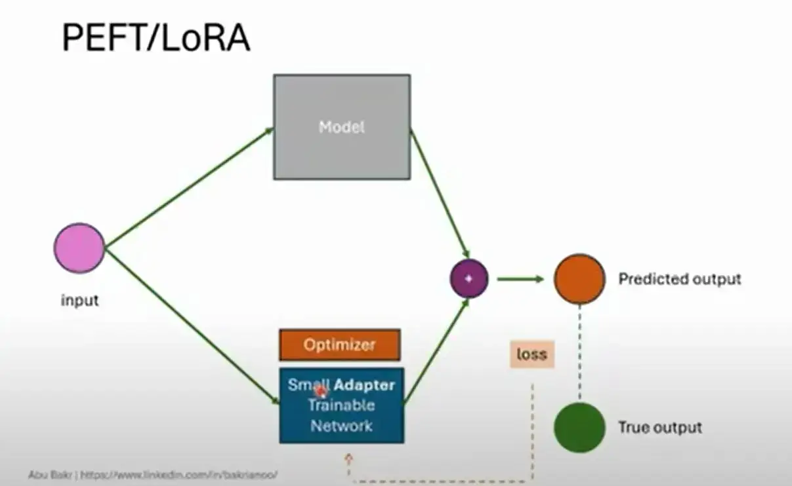
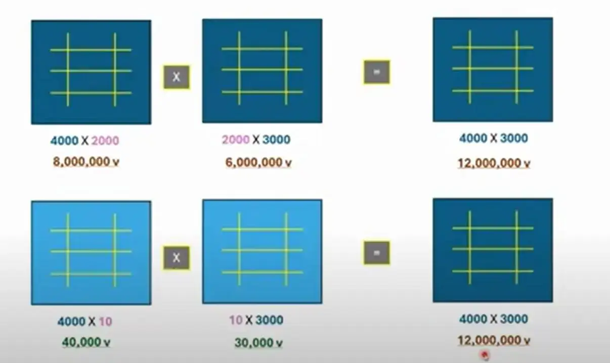

---
---
#NLP #NLP_fine_tuning [[abu baker]]

### Training 


----
### Finetuning 
في عملية ال finetuned احنا بنستخدم Model هو Trained قبل كده .

و لما اجي اعدل بعدل في ال head layer الي انا حاططها  ، فده بيبقي تكلفة اقل عليا . 

فمفهوم ال Finetuning انك عندك حاجه بالفعل و لكن بتعيد ضبطها . 

#### Classical Finetuning 


انك بت freeze جزء و بتعمل training لجزء تاني . 

و لكن فيه مشكله الا و هي عشان اقدر اعدل علي ال parameters الي عندي ، بيبقي عندي حاجه اسمها optimizer هو المسؤول عن انه يحدث parameters في ال trainable layer ، و العملية دي بتبقي مرهقة كده ده غير انها بتشغل مساحه في ال memory of GPU بتساوي من ضعفين الي ثلاثة اضعاف مساحه ال base Model اصلا . 

----
#### Finetuning using PEFT/LORA 


بدل ما كنت بستخدم optimizer علي ال trainable header layer و كان بياخد مساحه كبيره بناء علي قاعده المصفوفات دي 

هستخدم small adapter يركب عندي علي ال freezed model ، و بالتالي ال optimizer المستخدم هيكون small فالبتالي انا قدرت اوفر مساحه في ال GPU Memory الي عندي . 

و خلي بالك في مرحلة ال inference ال small adapter لازم يشتغل مع الموديل ، عشان ال small adapter مش هيطلع output لوحده ، لازم يكون معاه base model عشان يشتغل ، عشان هو لوحده ميطلعش ال output الي انا عايزه . 

------
### Example Article summary and translation (use case ) ? 
انك المطلوب منك انك تعمل local model (on perm) الهدف منه انك تديله article يطلعلك زي summary عنها و بعدين يترجمهالك للانجليزي مثلا  . 

**some problems should solved :**
انك دلوقتي مش معاك data عشان تقيس علي اساسها الموديل بتاعك شغال كويس ولا بيخرف (not have true predicted data ) - حل المشكلة في الحالة دي انك مثلا تستخدم cloud llm provider زي Chat Gpt مثلا و تديله ال articles الي عندك الي هو ال (input ) ، و تقوله علي الي انت عايزه و بعدين تاخد النتيجه دي و تحفظها علي جنب و هكذا بقي لحد ما تجمع مجموعة محترمه من ال true output data . 

---
### technologies / implementations : 
1. pydantic => common schema manager 
2. 


-----
### Key points : 
1. choose base model - instruct (for example queen 1.5B ~ 3 GB )
2. available input dataset (for my case : user-chat messages dataset )
```
[
{paitent : 
chatbot : } , 
{paitent : 
chatbot : } , 
......
]
```

3. create structured instructions for structured response , and give it to the llm model in the prompt . 
4. start create training dataset from large llms like Gpt 4o-mini 
5. take this training dataset , and take structured response 
6. create fintuned model from base model using llama finetunded configuration (LLAMA-Factory)


-----
Notes : 
- cloud llm (like openAi , Gemini)
- local llm (on - perm ) => يعني الموديل يكون شغال علي سيرفراتنا 
- knowledge distillation in deep learning mean there are two model (teacher and student ) , the student try to train from teacher . 
- the diff between base model and (base model + instruct ) 
	- base model => as a language model , complete the next word وظيفته انه يفهم كلامك و يكمل عليه فقط 
	- base model + instruct => the same function of base model + accept question and answer , because having instructions . 
- there are different between free text and structured text .... free text can't save in database , but structured text can do it  . 
- any LLM  have two : 1. model , 2. tokenizer  
و وظيفة ال tokenizer دي هو انه يقطع ال text لـ input يقدر يفهمه ال Model == بطريقة اخري انه بيحول ال text لـ ارقام و بعدين بياخد الارقام الي مطلعها الموديل الي كلام . 