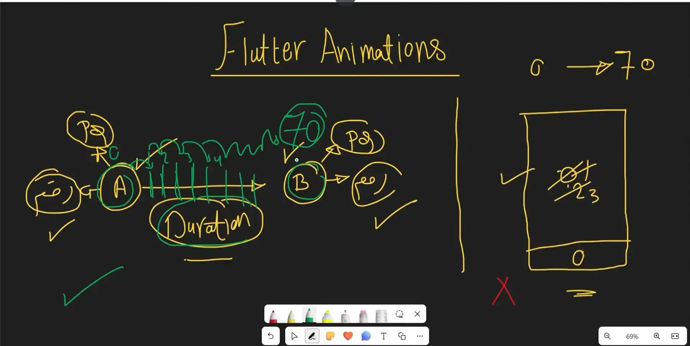
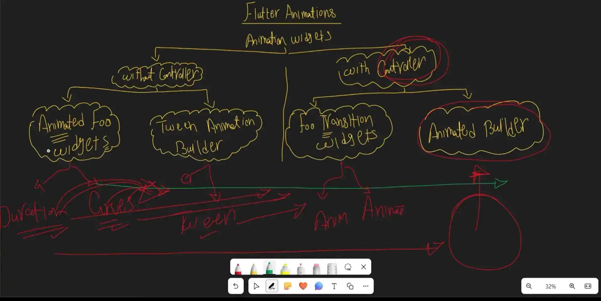
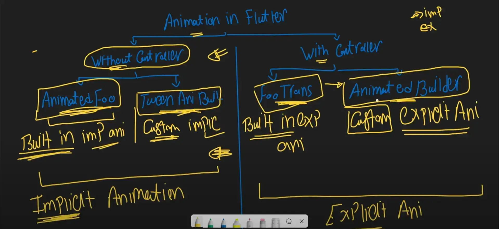

#status/complete  #source/Youtube
[[Flutter Animation Core]]

----
*المحتوي الذي لم يتم شرحه هنا او ربطه بهذه الملاحظة تم اضافته في ملفات المشروع الخاص بالبلاي ليست ، المشروع بعنوان "animations_tutorial"*


key concepts : 
1. what is the meaning of animation  
2. what is the tree of the animations in flutter  
3. animation controller in flutter 
4. animation status (Enum has 4 values (completed , dismissed , forward , reverse)) 
5. animation object value and animation controller value in flutter and what is the different between them  
6. remove status  listener and value listener 
7.  the diff between `positioned` and `align` and `slide` widgets ? 


---
- what is the meaning of Animation ? 

	- 

- what is the animations widget tree in flutter  ?
	- 

[[animation status in flutter animation]]


----

### remove status  listener and value listener
- عشان تعمل Remove لازم يكون معاك نفس ال reference of method الي انت عايز تعمله remove عشان يسمع في كله . 
```dart 
_animationController.removeStatusListener(methodName) ; 
```

- عايز بقي تعمل remove لل listener value 
```dart
_animationController.removelistener(methodName) ; // remove animation controller
_animation.removelistener(mthodName); // remove animation object 
```

----
### Animation Types (Popular Names) 
- Implicit Animation
- Explicit Animation 
- Custom paint Animation (Low level Animation) => use tween or animated builder (like clock progress)
- hero animation (like the avatar in chat fly from screen to another )
- third party animation (like bird eye look you when type the password) 

- 

----

### the diff between `positioned` and `align` and `slide` widgets ? 

positioned  
لازم يكون جوه Stack و بيقبل قيم اكنه pixel علي الشاشة مثلا 
align 
اولا بتبقي جوه اي widget ، و بتاخد اكبر مساحة ممكنه منه و تديها لل child بتاعها . 
slide 
بتزحزح ال widget بتاعتها نفسها بالنسبة للمكان الي هي فيه ، ملهاش علاقة بال parent or child 

