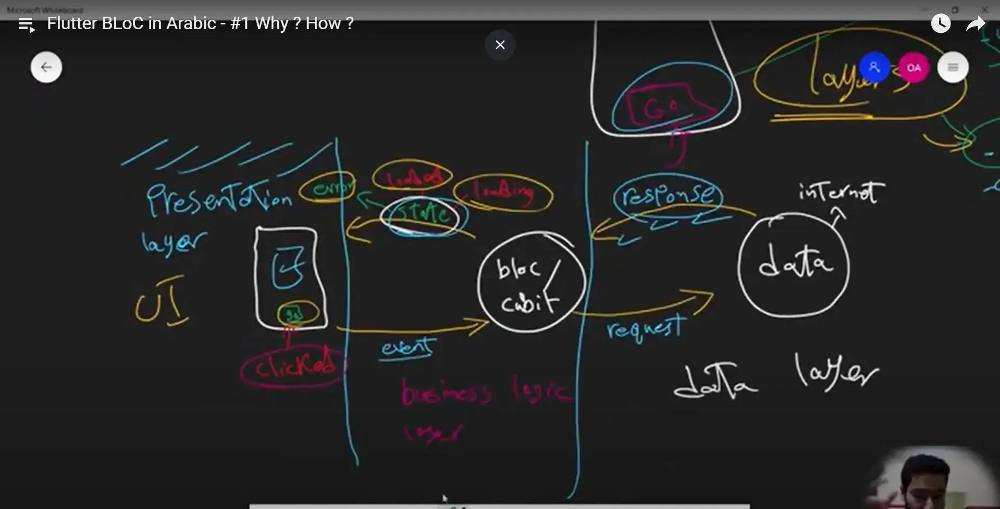
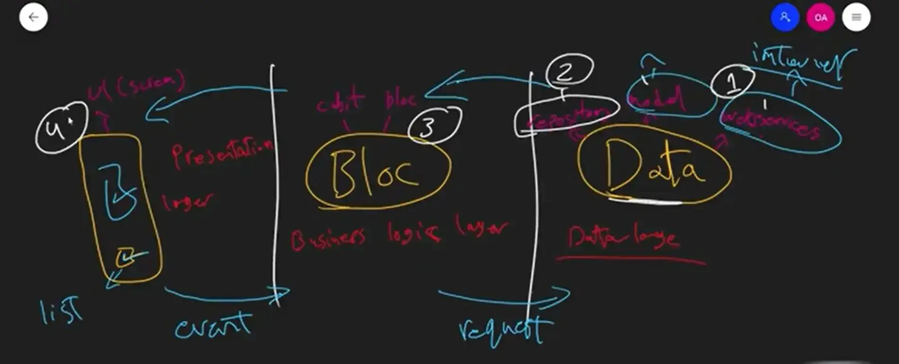
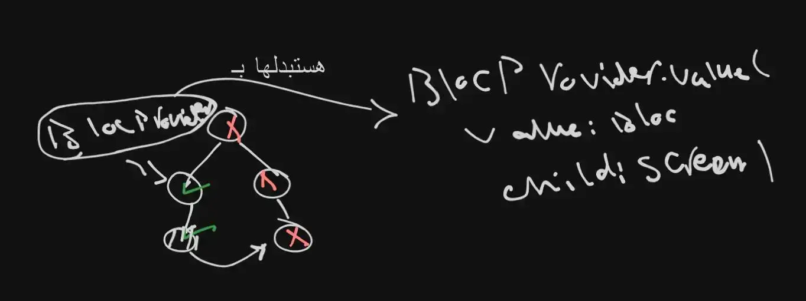

#flutter #flutter_statemanagement #Flutter_Cubit_Bloc

### Cubit 
- state:: 
	- is stream of data , and the function of bloc/cubit is listen to this state to take  action . 
	- زي اكنه تدفق من من  مجري المياه 

- what is the diff in the structure between bloc and cubit ? 
	bloc:: event -> bloc -> state 
	cubit:: function -> cubit -> state 

- to setup the cubit:: 
	- BlocProvider(create : (context)=> CubitName , child:)


- the main class in cubit::
	- BlocBuilder<cubitName , cubitState>(builder: (context , state)){} 
		- يمكن استدعاءه اكتر من مره 
	- BlocListener<cubitName , cubitState>(listener: (context , state)){} 
		- يفضل في المهام التي بيتم استدعاءها مره واحده مثل ال snack bar 
		- is Called once for each state change (not including initial state unlike BlocBuilder ) [more Explain this point](https://chatgpt.com/share/68461726-c578-800a-9bb5-6d16d9bbc270)
	- BlocConsumer<cubitName , cubitState>(
		builder:(content ,state){} 
		, listener(context , state){})
	- BlocObserver<cubitName , cubitState>(){}

- how to use variable from the cubit:: 
	- `context.read<CubitName>().nameOfVariabelOrFunction`
	- `BlocProvider.of<CubitName>(context).nameOfVariabelOrFunction`

- what is the diff between listener and builder:: 
	- listener : 
	- معناها انك محتاج تستدعي ، او تسمع الداتا مره واحدة و علي اساسها هتاخد اكشن معين زي انك تعرض رسالة مثلا للمستخدم او تنقله لصفحة تانيه ، من الاخر مش بيبني UI جديد او rebuild للسكرين . 
	- builder : 
	- انت هنا هتعمل rebuild للسكرين الي انت فيها و ممكن تستقبل اكتر من داتا هنا و علي اساسها بتعمل rebuild بشكل معين . 

---
### Bloc 

- Bloc:: 
	- State/Data management 
	- Design Pattern 
	- Architecture  Pattern 


- من اهم مميزات ال bloc فكرة ال layers 


- in the data layer there are three files : 
	  1. model file 
	  2. repository file 
	  3. web services file (api file)




ايضا الـ bloc قائم علي مفهوم ال streams / observers ... يعني تتابع من ال states الي انا المفروض بعملها listen في ال screen بتاعتي . 

### what is the diff. between bloc and cubit ? 
- ال cubit هو نسخة مصغره من ال bloc مع functionality اقل من ال bloc (افتكر مثال انك عايز تموت الدبانه مثلا الكرسي هو ال bloc و الكشكول هو cubit - خلي بالك الاتنين هيوصلو لنفس النتيجة و لكن الفكرة هنا في استخدام الاسلوب المناسب لتوفير المجهود )


---
### bloc components : 
- bloc Provider : 
ده بيدي قدرة اني استخدم ال bloc في كل ال child الي تحت ال widget الي فيه ال bloc provider 

و خلي بالك ال bloc provider بيبقي Lazy ، و كمان بيدي one instance للـ widgets الي تحته . 
- bloc Builder 
هو الي بيـ invoke ال bloc عندي 
و كمان تقدر تـ rebuild نفسها 
- bloc listener
بيحصل مره واحده مع ال state change عكس ال bloc builder 

- bloc consumer 
هو ميكس ما بين ال bloc builder + bloc listener 
builder => لو انت هتغير السكرين بالكامل 
listener => لو انت هتغير قيمة جوه السكرين مش السكرين كلها  

---

- what is Event in Bloc:: 
	- غالبا ال Event بيبقي هو اسم ال Function الي بتكتبها في ال Cubit ، و لكن بكل بساطه  ال Event هو الحدث الي ممكن يحصل من User مع ال  Screen الفلانية 
- bloc have two streams (event stream as an input , state stream as an output  ) . 
- cubit have one stream and one trigger (trigger function and stream state as an output )
- `on` method used to choose the event , take the event type and pass function callback [[Function call vs. Function callback]]

- `onTransition` and `onChange` 
	- ال bloc عنده ممكن اعمل `onTransition` او ال `onChange` ، اما بالنسبة لل cubit بقدر اعمل فقط ال `onChange` . 
	- `onTrarnsition` 
		- لما يكون انت عايز تعرف ال states ، هل هي مش بتتطلع ولا فيها مشاكل ، او عايز تعرف تفاصيل اكتر عن ال bloc  بتاعك ال states او ال Events و كده . 
		- و ده موجود في ال bloc فقط من غير ال cubit ، وهو ان اني اقدر اعرف ال events المسببه لل states معينه . 
	- `onChang` 
		- نفس فكرة ال `onTrarnsition` و لكن المره دي في ال cubit ، و لكن فيه نقطه ان في ال `onChange` مش عارف ليه ال state دي طلعت ؟ علي عكس في ال `onTransition` في ال Bloc بيعرفني ليه ال state دي طلعت (بيقولي ال event المسبب لل state دي ) . 

- `BlocObserver` 
	- عشان اقدر اشغل ال `onTransition` or `onChange` في ال code بتاعي من غير ما كل مره اعمل override علي ال `onChange` or `onTransition`  
	- فالحل في الحالة دي اني بعمل class بيعمل observer (يلاحظ) التغييرات الي بتحصل علي ال cubit or bloc الي جواه ، فبروح انشأ ال Class دي في صفحة لوحديه و بي extend من ال `BlocObserever` ، و بعد كده عشان اقدر انفذ بقي ال `BlocObserever` من الي انا عملته بروح بعمل 
```dart 
BlocOverrides.runZone((){
runApp(ScholarApp());
} , 
blocObserver: SimpleBlocObserver() , )

```

