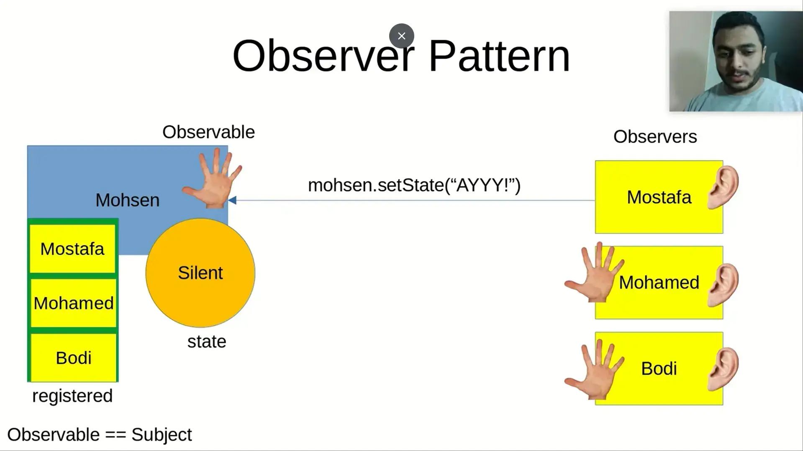

#software #SOLID_principles 
related:: [[Archive/MOCS 1/flutter]]
- معناه إنك تعزل ال Interfaces من بعضها 
- المشكلة ممكن  تظهر لما تكون عامل Interface بيعمل اكتر من Method و كل لما اجي اعمل inherent من ال interface ده مش هيستخدم كل ال methods الي في الـ Interface . 
مثال : 
1. المشكلة : لو عامل parking interface فيها الآتي : 
park -> ركنة 
up park -> خلاص العربية طلعت 
get capacity -> عدد العربيات 
❎calculate fee -> التكلفة 
من هنا بقي تنشأ المشكلة الا و هي اني مثلا لو ال parking ممكن يكون مجاني فبالتالي اديت صلاحية زيادة مش مستخدمة . 

الحل : انك تعمل Interface فيه الحاجات المشتركة ما بين ال paid و ال Free . 

مش هنحتاج اكتر من اساسيات الركنة 

