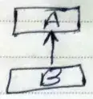
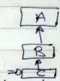
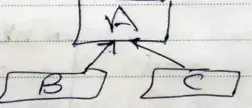

#software #oop 
inheritance 
بيبقي عندك  Childs بيرثوا صفحات مشتركه من ال parent . 
من الموضوعات المهمة في ال inheritance هي الـ override 
```dart 
@override 
void attack () {
// can add the method of super (parent)  + add your modifications 
super.attack(); 
print("your modification") ; 
}
```


- Types of inheritance ? 
	1. Single 
	
	2. multi level 
	
	
	3. hierarchical 
	
