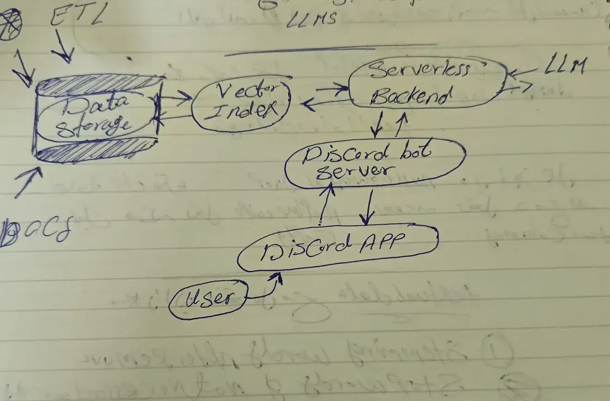
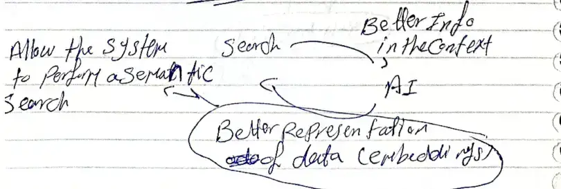
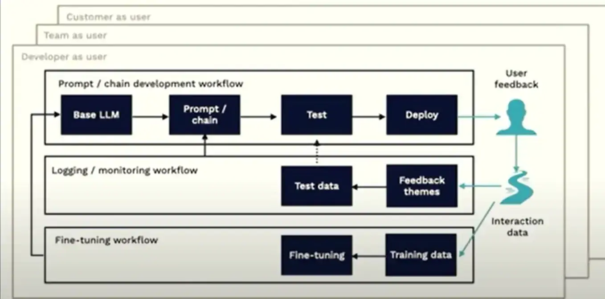

---
---
#ml_and_dnn 

-----

course link : https://fullstackdeeplearning.com/llm-bootcamp/spring-2023/

# LLM Bootcamp : launch an LLM App 

### History of LLMS 
simulate the performance of human , NLU (Natural language understanding ) the key of LLMs 

### Ai- Winter 
هي الفترة الي بيقل فيها إهتمام الناس و المستثمرين تجاه ال AI 

**Deep Speed** : من اكبر المكتبات الي بيتم فيها تجربة نماذج الذكاء الاصطناعي 

# Learn to spell : Prompt Engineering (LLM)

prompt => text goes into an LLM 

prompt Engineering => the Art of designing the text to make the LLM can understand it . 

## Prompt for ? 
### pretrained -> portal -> doc Generation 

### instruction-tuned -> wish -> just task but be precise 

### agent simulation -> Golem -> but of varying quality 

## in context windows 
1. zero shot 
2. one shot 
3. few shot 
4. decomposition shot 
5. Ensembelling (Parallel) 

# Data Augmented LLM
اعتبر ال LLMS  مثل الدماغ البشري في التعلم ، لكي يتعلم محتاج بيانات و ادوات . 

## context window alternatives (Augment LLMS) 
### Retrieval (with bigger corpus )
give the model data or information and make him search on what you want . (full-text-search ) or any search type 
#### Traditional info or any 
steps : 
1. query 
2. object => any entity inside collection data 
3. relevance => measure how well on object to what you need using AND -OR gates 
4. ranking => BM25 
#### Via Embedding 
search cycle : 

the Ai make the search not on just target like "dog" , but 
make the search also on the relevance word related with target like "ball" , "forest" , "cats" , ... 
that make search more efficient
### chains (more LLMs calls )
Allow model to do multi-task and complex task by split them into small task Either parallel or sequential depend on the task and the chain is designed for . 
### Tools (outside sources)

----
# Discord Bot for Questions Answering 

vector storage 
و ده عامل زي حبل الوصل بين ال user و ال cloud database ،  و  ده لانه بيقوم بتحول الquery الي جياله من ال user الي Embedding query يعني بيديها معني  ، و ده بيخليني اقدر اشوف عندي في ال cloud database الي عندي ايه اقرب vector لل query الي جيالي جديد دي(compare similarity ) و بعدين بحطها في ال cloud database بتاعتي . 
و بيتم الكلام ده من خلال 
NLP Model (like  Bert -based or sentence transformers )
cloud computing (Modal) 
بيخلي اقدر اعمل run للكود بتاعي و اتعامل مع ال API's من غير ما احط في دماغي جزئية التخزين  ، عشان دي مهمة الكلاود مش  احنا 

cloud DB (mongo DB atlas )
عبارة عن database اقدر اخزن فيها البيانات ، و بما انها cloud database فاقدر اتحكم في ال scale بتاع الداتا بيز و ده هيديني flexibility اكتر اثناء  تخزين البيانات 

----

# UX for Language User Interfaces 
بيتكلم عن اهمية وجود Language user interface ، حتي مع تقدم الذكاء الاصطناعي عشان 

### LUI patterns 
\- click to complete (playground) 
\- auto complete  (copilot)
\- command pallet  (Replit)
\- one to one chat (chat gpt )

----

# LLMOps (LLM Bootcamp)

the life cycle to create LLM 

### Choosing LM 

#### proprietary (حقوق الملكية ) 
is better than open source like : (claude.ai instant - gpt  )
#### Opens source 
like (Lama from Facebook - T5 from google )

### Iteration and Prompt management 

### Testing 
عشان تعرف تشوف إذا كان الموديل الجديد او ال prompt  الجديده افضل من ال Model القديم ولا لأ  . 
### Evaluation 

### Deployment and monitoring 
\ - using feedback to make the prompt better and fine - tune the model . 

**conclusion**

-----

# What's Next? (LLM Bootcamp)

the main goal of transformer for text format , but can adapt it on image ,but the problem of transformer that need amount of data so when the field is growth very fast there are 4 Questions 
### 1. Robotics 
مع التقدم الكبير في مجال Ai اصبح و امكانية ال transformers التعامل مع بيانات متنوعة اعطي امكانية في توسيع المجال اكثر و تعدد المهام المكلف بها ، و اعطي قابليه دمج ال transformers مع بعضها البعض. 
### 2. Scaling 
من المعيقات الكبيره ليست المال ولا توفر الامكانيات الحوسبيه (hardware) ، و لكن توفر high quality language data  . 
model size and data size must be scaled at a similar pace 
اصبح التركيز الاكبر ليس علي النماذج  الكبيره و لكن علي تحسين جوده و كفاءة النماذج الصغيرة و تقليل ال parameters اللازمة في النماذج الكبيرة large models و استبدالها ب API's or fine tunning smaller models 

### 3. AGI

### 4. Security and alignment 