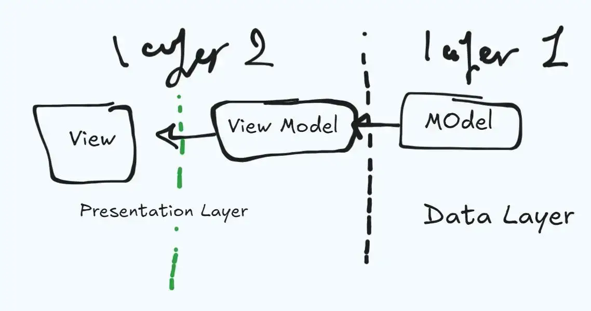
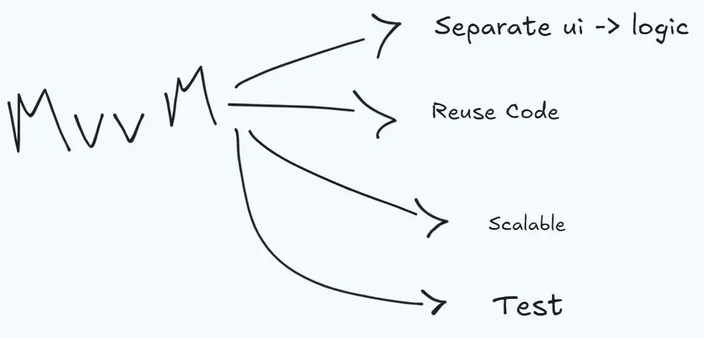
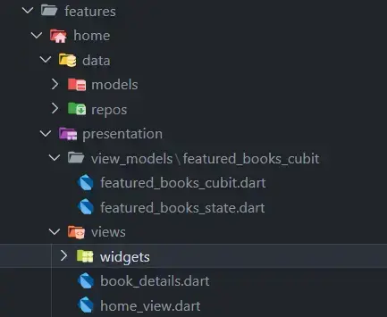

---
---
#software  #design_pattern #MVVM 
related to :: [[Archive/MOCS 1/flutter]]
### what is MVVM ? 
- Design Pattern 
- Design Architecture  

----
- هو design pattern مناسب للمشاريع الصغيرة و المتوسطه . 


----
### Why MVVM ? 



----
- تقسيمة ال folders in flutter projects : 
	- features folder  :
	- core folder : فيه الحاجات المشتركة في كل فيتشر 
```dart 
features/ 
	feature01
		presentation
			views 
				widgets
			view_models
		manager or data (contain all statemanagement)
core/ (the same things in some features)

```



- خلي بالك ال widget دائما immutable يعني مش بتتغير ، حتي لو كانت Stateful widget ، و لكن الي بيتغير ال State Object الي في ال stateful widget . 

- خلي بالك في نظام ال MVVM التقسيمة بتقي ماشية 2 في 2 يعني 2 layer في 2 layer في البداية (presentation layer + data layer ) و بعدين في ال presentation بيبقي (views layer + view_models layer )
- data layer => link with api or logic of the project 
- presentation => build screens and widgets and how to link api with the logic (state management) 
	- views => for ui screens 
		- widgets 
	- view_models => for state management (cubit , bloc , provider )
- 