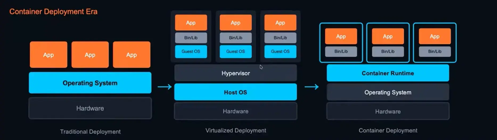
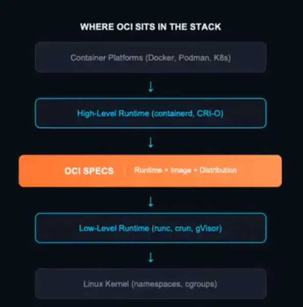

source:: https://www.youtube.com/live/B2bnl1SH_iA
materials(code + power point ):: https://github.com/helayoty/cloud-native-in-arabic

History to transition :: 
1. using Operating system on flash memory (Isolated) (take screenshot of your OS )
2. using guest and host operating system 
3. using container runtime and remove guest OS  (just containerize the program code and libraries ) 

container is not OS  virtualization , is Process Isolated from OS using Container runtime
Container is ONE  implementation the container ,there are other container implement services like (containerd, CRI-O ,etc... )
 

OCI (Open Container Initiative ) -- Standardization 
عبارة عن  Interface او Contact ثابت متعارف عليه لاي حد عايز يعمل Implement for Container . 
the main three specs must implement  :: 
1. run spec - how to run container process
2. image spec  - how to package containers 
3. distribution spec  - how to distribution images 
OCI location is between UI level and low code level 

## Docker Images vs. Containers

**1. Docker Image (The Blueprint)**
- **Definition:** A **read-only** template containing the application code, libraries, and config.
- **Analogy:** Like a **Class** in programming or a **Blueprint** for a house.
- **State:** Lifeless (doesn't "do" anything until run).

**2. Docker Container (The Living Instance)**
- **Definition:** A **runnable instance** of an image. It isolates the process.
- **Analogy:** Like an **Object** (`new Class()`) or the built **House**.
- **State:** Alive (consumes CPU/RAM).
- **Mechanic:** Adds a thin **Read-Write** layer on top of the read-only image.

| Feature | Docker Image | Docker Container |
| :--- | :--- | :--- |
| **Nature** | Static, Read-Only Template | Dynamic, Running Process |
| **Analogy** | Blueprint / Class | House / Object |
| **Modifiable?** | No (Immutable) | Yes (via Read-Write layer) |
| **Quantity** | 1 Image... | ...can create N Containers |  

