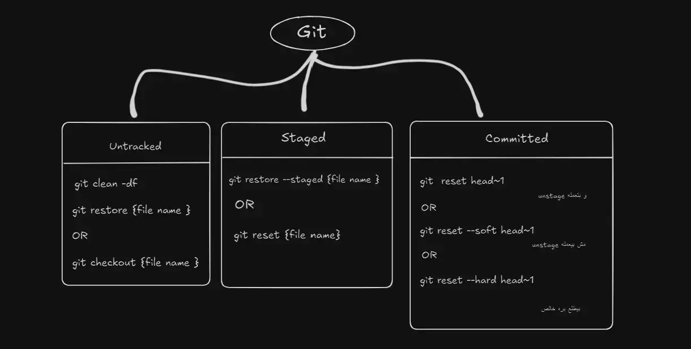

---
tags:
  - Git_GitHub
  - version-control
---

the main point of version control 
1. control on versions 
2. tracing changes 

---
git : local tool and we want an online platform to host git project and collaborate works and modifications 
1. GitHub 
2. GitLab


---
## quick commands 
```shell 

Dir   #عشان اجيب الملفات في ال Folder الي انا فيه 
cd \    #بيرجعني علي ال Root علطول
cd ..    #عشان ارجع back step 
mkdir  #عشان اعمل Folder جديد 
echo {content} > {file name.txt} #لو عايز تعملة و تضيف فيه كلام من البداية 
echo . > {file name} #لو عايز الملف فاضي 
dd {file name}       # عشان امسح فايل 
rmdr {folder name}           # عشان امسح فولدر 
copy {اسم الفايل الي عايز تعمله copy } {المكان الي عايز تحطه  فيه }

```
---

- اول حاجه Git بتعملها لما تحاول تربطها بالمشروع بتاعك 
1. working directory => git init  ,just look up on your files 
2. tracking files (snapshot) => git commit 

---

- Git Bash : 
بيترجم الاوامر / يعني ممكن اكتب نفس الاوامر الي بكتبها في ال CMD العادي زي ال Move و ال CD و كده و لكن العكس غير صحيح يعني لو فيه امر بيتكتب داخل ال Git Bash فقط ال cmd العادي  مش هيقدر يترجمه . 


---

Git Configurations 
- عشان تربط اي commit بيك او بالشخص الي عملها  
1. git config --global userEmail "-@gmail.com"
2. git config --global userName "-"

----

# how  git work ? 
1. git init => (working directory + create folder name ".git" )

- ".git" : 
1. staging area (for staging works)
2. repo history (to save commit history)

- "git repo" : 
معناها اني عملت "git." فقط 

- git add : 
بترفع الشغل لل stage ، دي بس الي فارقة بالنسبة لل git و بتعمله tracking اول لما ترفعه علي ال Stage غير كده مش بنعمل track بس بنشوف التغييرات الي بتحصل 

what is the diff between tracking and working directory ? 
- tracking : 
1. staging area -> snapshot (commit)
2. working directory : 
مش فارقة بالنسبة لل Git و بيبقي شايف التغييرات و لكن مش بيهتم بيها . 


- git log 
بيجبلي كل ال commit history 

- git checkout + {commit id}
عشان اعرض وضع الملفات الي كان عليه اثناء ال commit id ده 

**Branches** 

- git checkout {commit id } 
بتتحرك لل ال commit الي انت عايزه 

- git checkout main 
بتتحرك لل ال احدث commit اتعمل داخل الي main branch 

- git branch 
عشان تشوف ال branches الي موجوده 

- git branch {branch Name}
عشان تعمل branch جديد 

- git checkout {branch Name}
عشان اروح لل branch بتاعي 

----

- git switch {branch name }
بتتعامل مع ال branches 

**Head**
هو عبارة عن Pointer بيشاور علي ال آخر commit معمول في ال Branch عندك . 


> [!NOTE] Head Detached 
> لو انت انتقلت لـ commit قديمة (يعني مش Branch) فأنت  كده Head detached يعني انت كده التعديلات الي هتعملها مش هتتحفظ و عشان تحفها لازم تعمل branch جديد عشان التعديلات تسمع فيه . 

- git switch -c {branch name}
عشان تنتقل ل Branch غير الي انت واقف فيه و لو مش موجود يعمل واحد جديد و ينتقل عليه . 

- git checkout -b {branch name }
for creating move to other branch , "if not found" create new  branch then move to it  

**Merging**

- git merge {branch name }
لازم الاول تروح علي ال branch الي عايز الشغل كله يبقي عليه و بعدين تنفذ الامر ده . 

- git ls-files 
بيوريك الملفات الي معمولها Tracking 

- git clean -d 
لو عايز تعمل Un tracking لل folders and files  ، بس اكنك بتقوله لو عايز اعمل untrakcing ايه الي هيحصل و لكن هو مش بيمسح بالفعل . 

- git clean -df
هنا هو بيمسح بالفعل . 



- git branch -D {file name}
عشان احذف ال Branch 


----

**git stash**
فيه بعض الحالات  بتبقي انت شغال فيها علي ال Branch بتاعك ولاي سبب من الاسباب احتاجت انك تروح تحل bug في branch تاني مثلا ال main branch ، و لكن انت لسه مخلصتش التعديلات الي بتعملها عندك في ال branch بتاعك فالبتالي Git مش هيسمحلك انك تروح لل branch التاني من غير ما تقرر هتعمل ايه في التعديلات الي عندك هل هتمسحها ولا هتعملها commit (و الي بالمناسبة مش الحل الامثل ) ، لانك ممكن تكون شغال علي feature لسه مخلصتش فالبتالي الحل الانسب هو ال git stash 

- git stash 
بيحفظ التعديلات الي عملتها في ال branch بتاعي من غير ما اعمل commit ، و بعدين بيرجعني لآخر حالة  commit و بالتالي اقدر اعمل switch اخلص الشغل  و ارجع تاني لل branch بتاعي . 

- git stash apply 
عشان ارجع لل temporary saved و ابدأ اشتغل من حيث ما انتهيت ، و بيجيب التعديلات الي في الاول فقط . 

خلي بالك ال Stash عامل زي ال commit ممكن يحفظ اكتر من حالة و لكن الفرق ان ال stash بيستخدم كـ  temporary saver 

- git stash list 
عشان اجيب ال stash list الي  عملهم حفظ مؤقت . 

- git stash apply {id} 
عشان يرجع التعديل المعين الي انت عايزه ، و خلي بالك هو مش بيشيل التعديلات الحالية . 

- git stash drop {id} 

- git stash clear 
عشان يشيل كل ال stash list 

- git stash push -m "comment"
لو عايز تحفظ ال stash و تحدد اسمه برده ، و الموضوع ده بيسهل عليك الدنيا لما تيجي تستدعي stash بعينه . 

- git stash pop 
بيرجع آخر Stash اتعمل و كمان بيعمله drop في نفس الوقت 


- git reflag 
بيجيب كل التعديلات History الي حصلت في ال Repository بتاعك ، و بتاخد ال ID بتاع ال commit الي انت عايز ترجعه 

- git reset --hard  Id 
عشان  لو مسحت commit مهم و عايز ترجعة 

1. hard : do overwrite , if file not empty  
2. soft : don't do overwrite , if file not empty 

---

- git branch -r //to show remotely branches 
- git branch -a //to show all branches in the repo 
- git remote prune origin //to delete any destroyed branches on repo 
- 
# Commands 
## Basic Setup
```bash
git config --global user.name "Your Name"  # Set your Git username.
git config --global user.email "your.email@example.com"  # Set your Git email.
git config --list    # List all Git configurations.
```

## Initializing and Cloning
```bash
git init              # Initialize a new Git repository.
git clone <repo-url>  # Clone an existing repository.
```

## Status & Logs
```bash
git status                 # Show current status of changes.
git log                    # View commit history.
git log --oneline          # Concise commit history.
git log -v                 # to show the history of commits (author,date,hash and files added ) 
```

## Working with Changes
```bash
git add <file>             # Stage a specific file.
git add .                  # Stage all changes.
git commit -m "Message"    # Commit with message.
git commit -am "Message"   # Add and commit tracked files.
git commit --amend         # Edit last commit or add changes.
git commit -a -m           # to adding to stage and commit together.
```

## Handling Merge Conflicts
```bash
git diff                   # Show differences.
git diff <branch1> <branch2>  # Compare two branches.
# Resolve conflicts manually, then:
git add <file>
git commit
```

## Branching & Merging
```bash
git branch <branch>            # Create new branch.
git checkout <branch>          # Switch branch.
git checkout -b <branch>       # Create and switch branch.
git merge <branch>             # Merge a branch.
git rebase <branch>            # Reapply commits.
git rebase -i HEAD~<n>         # Interactive rebase.
git branch -d <branch>         # Delete branch.
git branch -D <branch>         # Force delete branch.
git checkout <hash of commit>  # to restore to specific commit you want 
```

## Undoing Changes
```bash
git reset <file>               # Unstage file.
git reset --soft HEAD~1        # Undo last commit, keep staged.
git reset --mixed HEAD~1       # Undo last commit, unstaged.
git reset --hard HEAD~1        # Remove last commit.
git revert <commit-id>         # Create commit to undo changes.
```

## Stashing Changes
```bash
git stash                      # Save changes.
git stash list                 # List stashes.
git stash pop                  # Reapply & remove stash.
git stash apply                # Reapply without removing.
git stash clear                # Remove all stashes.
```

## Collaborating & Pull Requests
```bash
git branch -a                        # List all branches.
git push origin :<branch>           # Delete remote branch.
git push  --all origin              # upload all local branchs on remote
# Pull Requests:
# 1. Push your branch.
# 2. On GitHub, click "New Pull Request".
```

## Remote Repositories
```bash
git remote add origin <url>         # Link local repo.
git remote -v                       # Show remotes.
git remote set-url origin <url>     # Change remote URL.
git remote rename <old> <new>       # Rename remote.
git push -u origin <branch>         # Push to remote.
git pull origin <branch>            # Pull from remote.
git fetch                           # Fetch changes (just lookup) still need make git pull 
git fetch <remote>                  # Fetch from specific remote.
```

## Advanced Operations
```bash
git cherry-pick <commit>            # Apply a commit.
git cherry-pick <start>^..<end>     # Apply a range of commits.
git tag <tag>                       # Tag a commit.
git tag -d <tag>                    # Delete a tag.
git reflog                          # History of changes.
git reflog show <branch>            # Reflog of a branch.
git show <commit-id>                # Show commit details.
git bisect start                    # Start bisecting.
```

## Reviewing Changes
```bash
git show <file>                     # Show file changes.
git diff <commit1> <commit2>        # Compare commits.
```

## Help Command
```bash
git help <command>                  # Help on command.
```

## GitHub CLI & API
```bash
gh repo create                      # Create GitHub repo.
gh repo clone <repo-url>           # Clone repo.
gh pr create                        # Create pull request.
gh pr list                          # List pull requests.
gh issue create                     # Create issue.

curl -H "Authorization: token YOUR_TOKEN" https://api.github.com/repos/USERNAME/REPO_NAME/issues
# List repo issues.
```

## Submodules & Worktrees
```bash
git submodule add <repo> <path>    # Add submodule.
git submodule init                 # Init submodules.
git submodule update               # Update submodules.
git worktree add <path> <branch>   # Add worktree.
```

## Cleaning Up
```bash
git clean -f                       # Remove untracked files.
git clean -fd                      # Remove untracked files/dirs.
git gc --prune=now                 # Cleanup and optimize repo.
```

## Repository Management
```bash
git shortlog -s -n                 # Commits by author.
git describe --tags                # Readable commit name.
git blame <file>                   # Who last changed each line.
git grep "term"                    # Search repo.
git revert <commit1>..<commit2>    # Revert range of commits.
git archive --format=zip HEAD -o latest.zip  # Zip latest commit.
git fsck                           # Check repo integrity.
```

## Best Practices and Common Workflows
- **Commit Often**: Clear, frequent commits.
- **Branch for Features**: Isolate features or fixes.
- **Use Meaningful Messages**: Describe the change.
- **Pull Regularly**: Stay up-to-date.
- **Resolve Conflicts Promptly**: Avoid compounding issues.
- **Review Thoroughly**: Maintain quality.
- **Tag Releases**: Easy milestone tracking.
- **Clean Branches**: Delete unused branches.
- **Use Git Hooks**: Automate checks.
- **Squash Commits**: Clean history before merging.
- **Avoid Large Commits**: Keep changes atomic.
- **Descriptive Branch Names**: E.g., `feature/login`.
- **Keep Main Deployable**: Always stable and ready.

_Spoorti Shetty_


# Details
