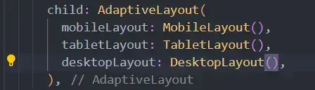

#flutter 
- what is the diff between `LayoutBuilder` and `Mediaquery` ?
	- `LayoutBuilder` : take the width of the parent 
		- `Mediaquery` : take the width of the screen 
- `Flexiblee` Widget ? 
	- نفس استخدام ال Expand تقريبا و لكن فيها ميزه بقي انك دلوقتي لو مدي مساحة او حجم لل child بتاعك و عايز ان لو حصل تغير في حجم ال Screen تقل عن الحجم ده و لكن متزدش عن ال size الي انت حاطه . 
- `FittedBox` widget ? 
	- بتخلي ال child يـ fit داخل ال parent 
	- فيه مشكلة ممكن تقابلك الا و هي و انت لما تستخدم ال  `FittedBox` لو الحجم كبر تلاقي ال child حجمه كبر برده و لكن انت مش عايز كده فالحل انك تخلي ال fit يبقي `BoxFit.scaleDown` يعني بتقول لل child لو الحجم المتاح ليك اكبر من الي انت محتاجه متكبرش نفسك و خلي حجمك زي ما هو و لو المتاح ليك اصغر من الي انت محتاجه صغر نفسك عادي و لكن متكبرش نفسك . 


- 
- خلي بالك هنا احنا عملنا `Widget` بتستقبل و بتهدنل جزئية ال Layout دي شيء جميل ، و لكن فيه مشكلة كبيره فيها الا و هي بالشكل ده كده انا كل مره هضطر اباصي ال widget بتاعة كل layout حتي لو مش بعرضه يعني انا مثلا لو محتاج اعرض ال desktop layout هيظهر عادي و لكن في نفس الوقت هيتم استدعاء object من ال two layouts (mobile , tablet) بالرغم من اني مش عارضهم في الوقت الحالي و ده هيأثر علي اداء التطبيق ، و الحل في الحالة دي اني استخدم ال callback لان ال callback لازم ابصيله او ممكن اباصيله context جديد و بيبقي lazy call يعني مش بيتنفذ الا لما احتاجه او اعمله build . 

- `Device Preview` ? 
	- لو عايز تعمل test للتطبيق علي اكتر من جهاز . 
```dart 
void main () {
runApp(
DevicePreview(
enabled : true , 
builder : (context) => const MyApp() ; 
) , 
) ; 
}
```
```dart 
return MaterialApp(
locale : DevicePreview.local(context) , 
builder : DevicePreview.appBuilder , 
home : const HomeScreen() , 
)
```

- responsive text ? 
	- scale factor for different platforms (mobile , tablet , Desktop)
	- min and max font size 
		- قيمة مينفعش اقل عنها و قيمة مينفعش ازيد عليها . 
	- how to calculate the scale factor ? 
		- scale factor = current width / base width related to each platform 
			- يعني انا بحدد زي Base كده لكل platform علي اساسه اقول ان ال text المفروض حجمه يزيد او يقل . 
		- font size limit (min , max ) 
			- مثلا اقصي حاجه ممكن يقل عندها هي 20 % و اقصي حاجه 20% 
			- `final fontsize = scaledFontSize.clamp(baseFontSize * 0.8 , baseFontSize * 1.2) `

- `RenderFlex` problem : 
	- معناها ان المشكلة الي عندك جاية لاما من `Column` او من `Row` 

- `Expanded` Widget : 
	- لازم تيجي `Row` او `Colum` 

- لو عندي عدد ثابت من ال items بشكل horizontal ، و ليهم مساحة معينة و هما المفروض بتقاصموها مع بعض يبقي الحل الامثل ليا في الحالة دي هو ال `Row` مش ال `Listview.builde() ` ، عشان اكتر من سبب ، الاول ان ال `listview` بتخلي ال items الي جواها تاخد اقل مساحة ممكنه مقدرش اعمل Expand لل items الي داخل ال `listview` 

- لو انا دلوقتي عملت mapping لل items بتاعتي ولكن عايز برده يكون ليا تحكم في ال index بحيث هطبق condition معين علي item داخل ال list الي عندي اعملها ازاي ؟ 
```dart 
//items.map((e) => Expanded(child: AllExpandedItem(itemModel : e ))).toList ; 
items.asMap().entries.map((e){
int index = e.key ; 
var item = e.value ; 
if (index == 1 ){
return Expanded(child : 
Padding(padding : const EdgeInsets.symmetric(horizontal : 12 ) 
child : AllExpensesItem(itemModel : item)  ) ) ; 
}else { 
return Expanded(child : AllExpensesItem(itemModel : item ) ); }
}).toList() ; 
```


- خلي بالك في استخدام ال `Expanded` ، لان مش لازم او مش دائما بنستخدمها ما بين two widgets و خاصة علي مستوي ال y - vertical لان علي مستوي ال horizontal معظم الاحيان بنستخدم `Expanded` ده طبيعي ولكن علي ال vertical لازم اشوف الاول 

- `intrinsic Widget` 
	- بيستني يحسب  ال width و ال height علي اساس اكبر height او width في ال children . 


- scroll page view 
	- عشان تظبط جزئية انك عندك اكتر من كارت 
	- بنستخدم `pageview.builder()` بيبقي نفس استخدام ال `listview.builder()` برده . 

- فيه مشكلة واجتنا الا و هي انا عايز ال pageview تاخد او تحسب ال height بتاعها من خلال ال child او علي اساس ال child
	- من ضمن الحلول ان ابدأ اخلي ال child تقولي ال height بتاعها ايه و احفظ ال height ده عندي في List مثلا و لما يجي ال item الي ال index بتاعه كذا  اغير ال height بتاع ال `pageview` علي اساسه ، بس خلي بالك الحل ده مش هينفع مع ال `pageview.builder()` لانها مش بتعرض كل ال items الي عندك لأ ، هي بتعرض الي هيظهر علي الشاشة فقط في الوقت الحالي و انت بتقول عايز تحفظ ال heights الاول قبل ما يتم بناء ال items معني كده في حالة عمل build ل new item هيحصل مشكلة في حسبة ال height و بالتالي ممكن حاجه تتضرب منك ، لذلك الحل ده هيكون مناسب لو انت هتستخدم او عارف عدد ال items و مش هتستخدم ال `pageview.builder()` 
	- طب تمام ازاي بقي هنحسب ال height بتاع ال item or children ؟ 
		- باستخدام #flutter_package اسمها `expandable_page_view` 
		- و ممكن اعمل generate لل list من خلال `List.generate(count , (index) => MyWidget()) `
- how to create dots indicator 
	- video to explain : [103](https://www.udemy.com/course/mastering-flutter-responsive-adaptive-ui-design-arabic/learn/lecture/41749842#content)
	- create the dot indicator , we use `AnimatedContainer` to add good view when change between active and in active indicator 
	- try to make the dots is generated not fixed 
	- how to link the indicator with page view ? 
		- using `pageController` , `pageController.page` 
		- what is the diff between `toInt()` or `round()` ? 
			- `toInt()` : 1.6 => 1 
			- `round()` : 1.6 => 2 
		- then pass the page index to the list of indicators and check `index == currentPageIndex` make the indicator is active . 


- How to create income Charts ? 
	- using #flutter_package `Fl_chart` 

- خلي بالك اي Widget بتبقي فيها ميزة ال Scrolling زي ال `listview.builder()` او ال `SingleChildScrollView()` مينفعش احد جواها ال `ExpandedWidget` عشان ال widgets ال scrollable بتعمل shrink لل items الي جواها و ال Expand بتعمل العكس فكده فيه عمليتين بيحصلوا عكس بعض . 

- من فوائد ال `shrinkWrap = true` انها بتخلي ال `listview.builder()` تبقي مش lazy عشان انت بقيت تحدد ال dimensions بتاعة ال list قبل ما تبنيها ، و خلي بالك ال `CustomScrollView` بتبقي شغاله lazy build 

- خلي بالك ال `FittedBox` مينفعش نستخدمها مع `Spacer()` او `Expanded` 

- من اجل حساب ال Width بتاع الشاشة من غير ما استخدم ال `MediaQuery` عشان مشكلة ال context 
	- https://www.udemy.com/course/mastering-flutter-responsive-adaptive-ui-design-arabic/learn/lecture/41778752#overview
	- و الفرق الجوهري ما بين الطريقة المستخدمه هنا و الي هيا ال `dispatcher` و ال `MedaiQuery` هي عملية ال rebuild في حالة ال `MediaQuery` بعمل trigger لل rebuild و بالتالي التغيير بيسمع عندي في لحظتها من غير ما اعمل Reload 

- #flutter_package  Device Preview 
	- عشان نعمل test علي اكتر من device 

- what is the diff between `Sizedbox` and `Padding` ? 
	- في ال Padding خلاص بقت اكنها جزء من ال widget 
- لو عايز اطبق constrains علي ال `AspectRatio` او ال child بتاعي بشكل عام بستخدم 
	- بستخدم `ConstrainedBox` و بتاخد مني `constraints : BoxContraints()`  