related:: [[Archive/MOCS 1/OOP MOC]]
link:https://maharatech.gov.eg/course/view.php?id=2206
#maharaa 

---

- Encapsulation :
	- 
- Polymorphism : 
	- overloading : 
		- many functions in one class  have the same name but not the same in the signature
	- overriding : 
		- among functions in inheritance tree (not in same class )
		- باختصار الطريقة دي بتنفع مع ال inheritance classes و بتخليني اقدر اعيد استخدام نفس ال functions الي في parent في ال child ، و بتزود ال Accessibility يعني لو ال function في ال parent كانت protected ممكن اخليها في ال child بتاعي protected or public مقدرش اخليها private 
		- في جزئية مهمه لو عملت pointer من ال parent بيشاور علي جزء في ال child فهو كده بيشاور علي الجزء الخاص بال parent فقط  ،و ال child مقدرش اعمل pointer بيشاور من ال child للـ parent 

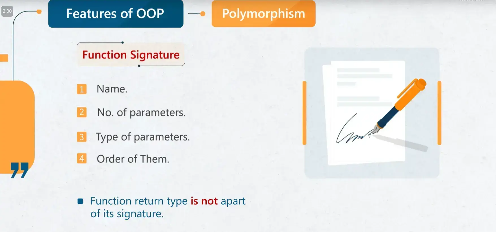

- Abstraction : 
- Inheritance : 

---- 
- Functions 
	- Default Arguments 
		- خلي بالك لما تيجي تحط default value ل parameters في الفانكشن لازم يكون جه اليمين يعني مثال : `int sum (int x = 0 , int y) ` الشكل ده غلط ليه لاني حطيت لأول قيمة و المفروض يكون ال default في الاخر يعني علي اليمين مينفعش يقطعك حاجه في النص مش بتاخد default value 
		- ال parameter الي ليه default value مش بيتعد في ال Signature

- Constructor vs Destructor 
	- constructor :
		- Default Constructor 
			- و ده الي بيتنده اول لما تعمل allocate لل object of class 
			- و في حالة انك عملت constructor بإيدك كده ال default اعتبره مش موجود 
		- constructor can be overloaded
	- Destructor : 
		- و ده الي بيتنده قبل ما ال object يحصله destroy و بنسبق اسمه بـ `~` 
		- منقدرش نعمله overload

- Friend function 
	- outside class function can access to the private attributes in class by using the prototype `friend function name() ;` inside the class and do the implementation outside the class . 
	- in `c++` but not found in the c or `c#` 
- pass by value (bitwise copying) 
	- share copy of data 
		- original class => allocation then, run constructor  
		- copied class => allocation then, bitwise copying 
	- the Dynamic Area Problem 
		- this problem happen when send the address of the array to another class and destructor the another class this mean also delete the array in that shared 
		- **solution:** 1)pass by reference not pass by value , 2) create a copy constructor that take the reference of the original class and in the implementation of constructor create new allocation for the array that mean when bitwise copying happen the another object take new address for the array **the advantage of copy constructor that make the number of constructors and destructors is equaled .** 
- pass by reference 
	- mean the another class that refer to the first object that created , that help to solve the problem of `Dynamic Area problem` , because now there are one destructor 

- class Relations 
	- 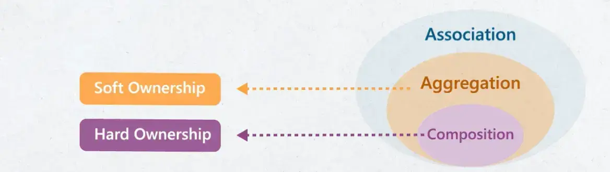
	- Association 
		- relation between two classes "just use" , each class has own lifecycle indecently
		- 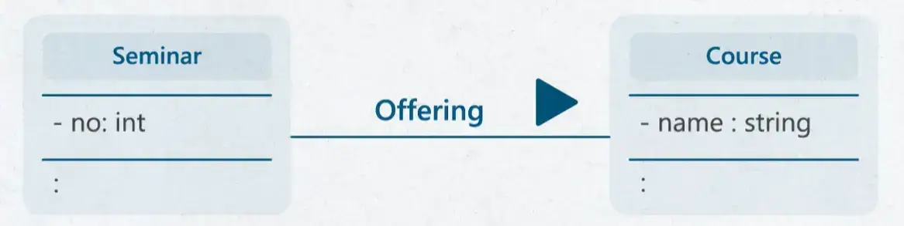
	- Aggregation (Strong Association) 
		- هي علاقة احتواء يعني الجزء الاول يحتوي علي الجزء التاني و كل جزء ليه الليف سايكل بتاعته و ممكن الاتنين يتحذفوا مع بعض او واحد يتحذف و التاني يفضل . 
		- relation between two classes "has" 
		- each class has own lifecycle also 
		- 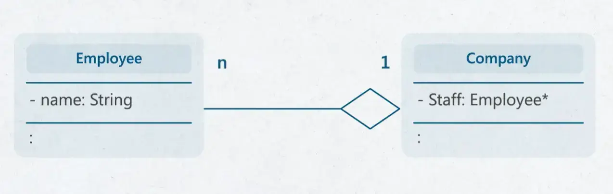
		- لو لقيت نفسك بتعرف ال association جوه ال constructor يبقي دي علاقة aggregation 
	- composition 
		- Strong type of Aggregation 
		- part not have own lifecycle 
		- when the container is deleted the part also deleted 
		- 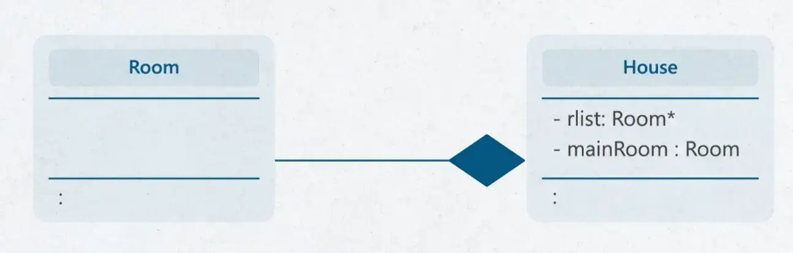
	- inheritance 
		- it's "is A " or "kind of " 
		- reuse the main class 
		- constructor A then B (child)
		- destructor B first then A (parent)
		- the child carry the parent attributes but can't access it if private (as a black box)
		- 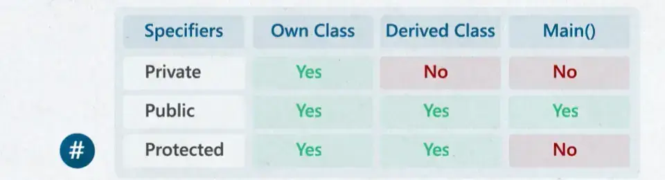
		- Types of inheritance 
			- 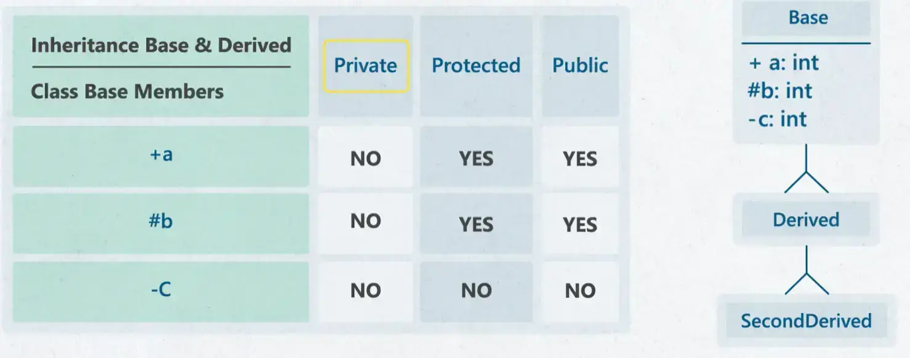
		- Multiple inheritance 
			- خلي بالك مثال لما تيجي تشرح ال inheritance و تقول انه زي انك بترث الصفات من بابا و ماما دي يعتبر association اصلا مش inheritance و بالتالي مينفع يبقي فيه child يبقي ليه two parents و تديله كل حاجه ده بيؤدي للغبطه كتيره جدا + انت كده بتقفل ال Tree diagram بتاعك ، و هتظهر مشكلة تاني الا و هي انك دلوقتي لو ال two parents ليهم نفس اسم ال attribute و عايز تيجي تستخدم واحد منهم ده بيؤدي الي انك لازم تكون مصحصح و انت بتكتب الكود و عرضه اكبر للخطأ ، و كمان انت ممكن يكون الاتنين بيعملوا نفس المهمه بالتالي انت عملت call for two same attributes و ساعتها الحل هنا هيكون انك تعمل class تاني جديد و تديله  اسم ال virtual 
		- 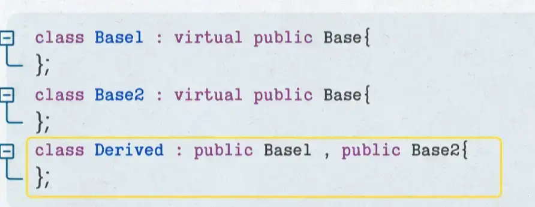
- Dynamic Binding 
	- احنا قولنا لو عملنا pointer من نوع ال parent  و بعدين خليته يشاور علي ال child اثناء ال compile time هو هيقدر يشوف بس ال parent part في ال child غير كده ملوش اكسس عليه ، طب نحل المشكلة دي ازاي من خلال ال dynamic binding ، و الحل ببساطه اني بحد virtual قدام ال attribute في ال parent و ال child عشان اقول استني متحددش قرراك في ال compile time لا ، حدده في ال Runtime و بالتالي هيشوف لو ال child فيه نفس ال attribute و معموله مثلا override هيستخدمه علطول اما لو ملقهوش هيستخدم الي في ال parent  
	- 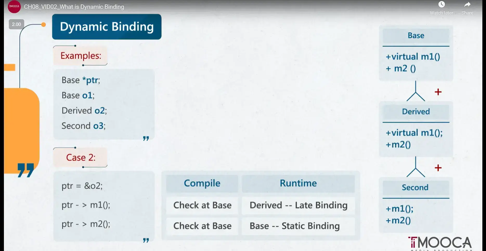
	- v-table 
		- بيحدد في وقت ال runtime اي نسخة من ال function هي الي هتشتغل 
		- build in compile time for overriding functions 
		- put static binding at compile time 
		- put dynamic binding at runtime 
		- و خلي بالك في اللغات الحديثة زي java كل functions بيبقي ليها virtual by default 
		- خلي بالك برده ال virtual function مش بتيجي غير ما ال public inheritance 
		- pure virtual function == Abstract function 
- Template class 
	- 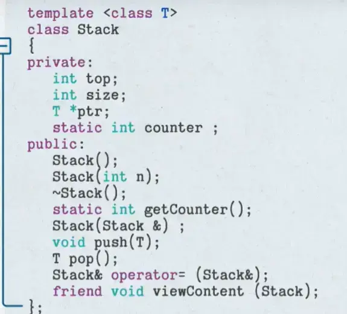
	- 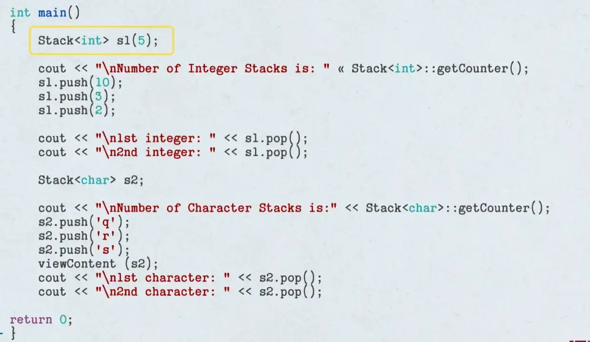

