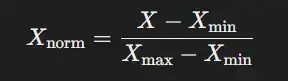

---
---
#ml_and_dnn 

we first need to know what is Normal distribution or Gaussian distribution (المنحني الجرسي) 

---

important Article : https://www.datacamp.com/tutorial/normalization-vs-standardization
### Normalization 
refers adjust the values measured on diff scales to a common scale . 
#### types of Normalization (مش كل الانواع )
\- Min-max normalization
بيحصر القيم ما بين ال 0, 1  

\- Mean normalization (mean-centering)
بناخد متوسط القيم و بعدين نطرحه من القيم نفسها و نشوف القيم 

#### when should you normalize  data  ? 
**امتي بنستخدم ال normalization or standardization  ؟ لاما يكون التوزيع بتاع البيانات المرتبطة يكون مش ماشي علي شكل ال gaussian distribution** و ده بيحسن من اداء الموديل بحيث ميكنش فيه bias لقيم معينه او للقيم الكبيره ، فيما تسمي عمليه توحيد قيم الداتا ب feature scaling . 
##### 1. Gaussian distribution 
parameters : (m, z ) 
- m : mean(the average number )
- z : standard deviation  (the distribution of numbers around mean )

بكل بساطة Normal distribution بيعبر عن طريقة توزيعة مجموعة من الناس بشكل معين ، يعني مثال علي ذلك لو عايز تعرف توزيعة درجات الطالب  هيبقي كالتالي : 
مثلا متوسط درجات الطلاب في امتحان معين كان 20 من 50  فده معناه ان ال mean = 20 
اما ال standard deviation عن مدي اقتراب درجات الطلاب  من المتوسط ده  . 

##### distant-base algorithms like K-Nearest Neighbors (k-NN)

### Standardization ( Z-score range )
![[Pasted image 20241023215254 1.webp|300]]
بيتبع مبدأ centering and scaling data  

#### when should you standardization data ? 
##### Gradient-based Algorithms like SVM
##### Dimensionality Reduction (PCA) 

يعني تقدر تقول من الاخر ان ال standardization عبارة عن حالة خاصة من ال Normalization ، عندما يكون mean = 0 and standard deviation = 1 ، نقدر نقول هنا ان ده standardization 

### what is the diff between gradient-based algorithms and distant-based algorithms ? 
Gradient-based algorithms optimize models by minimizing a cost function using gradients (e.g., in neural networks , SVM). Distance-based algorithms, like k-NN, classify data points based on their distance from others in feature space, without involving gradients.
