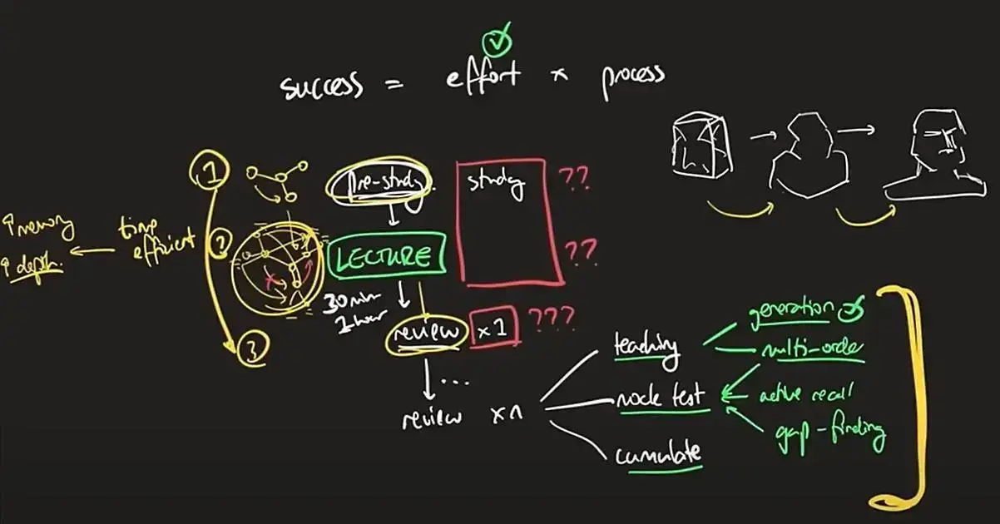

---
---
#productivity #how_to_study 

---
المعدل الاقصي او المعقول للدراسة في اليوم 5 ساعات لان في حاله الزيادة عن هذا الحد يبدأ المنحي في الهبوط  - طبعا هذا الكلام مش شرط يعني ممكن يزيد عن كده و فيه ناس بتعمل كده فعلا و لكن دي حالات خاصة . 

>[!Note]
success in studying = Effort *  Process 

من الاشياء التي دقق عليها Justin sung هو عند دراسة المحاضرة يجب ان تبني نظام متراكم فوق بعضه البعض زي ما تقول كده انك بتبني منحوته في كل مره انت بتعيد صياغتها و تغير في تفاصيلها لحد ما توصل الي الشكل النهائي للمنحوته و لكن انت بتبقي شغال طول الوقت علي نفس المنحوته يعني مروحتش جبت منحوته تانيه ، و ده المقصود بالنباء التراكمي علي نفس المحتوي . 

فمثلا في المثال الي شرحه ده ... قالك في عملية ما قبل الدراسة يعني قبل ما تتفرج علي فيديو شرح او تستمع للدكتور في المحاضرة حاول في البداية تبص علي المحاضرة لوحدك مع نفسك و بعدين تكون مفهوم عام عن النقاط العامة و الامور الي انت حاسس انها هتبقي صعبة او مهمه في المحاضرة و بناء زي structure عام ليها باستخدام مثلا  ال Mind map  و الموضوع ده هياخد منك حوالي من 20 الي 30 دقيقة مش مشكلة الوقت مدام انت بتستغله صح ، و بعدين تتفرج علي المحاضرة نفسها بقي و تبدأ تضيف تفاصيل اكتر علي ال Mind map بتاعتك و بعدين تصحح بعض التصورات الخاطئة الي انت عملتها مثلا و هكذا لحد ما توصل لشكل شبه نهائي من ال Mind map بتاعتك و ده بيساعدك علي تحسين حفظ المعلومة لانك اتفاعلت مع المحتوي المشروح ليك من خلال التعديل علي الاشياء الي انت فهمتها غلط و هكذا .... و بعدين تبدا عملية المراجعة بتاعك بعد فتره من خلال ال active recall تحاول تفتكر محتوي المحاضرة من دماغك و بعدين تشوف النقاط الي معرفتش تفتكرها  ، و بعدين تخش علي الاسئلة و تحل اسئلة كتير علي قد ما تقدر عشان ده هيقوي المعلومة عندك و يخليها مترابطه و متماسكه مع بعض البعض . 

----
## Reference 
1. https://www.youtube.com/watch?v=7lYpkdMZ4lA&pp=ygUZIFBlb3BsZSB3aXRoIGdvb2QgZ3JhZGVzIA%3D%3D
