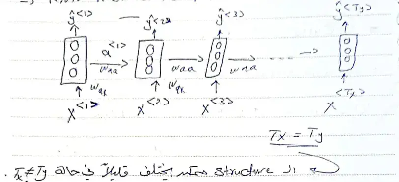
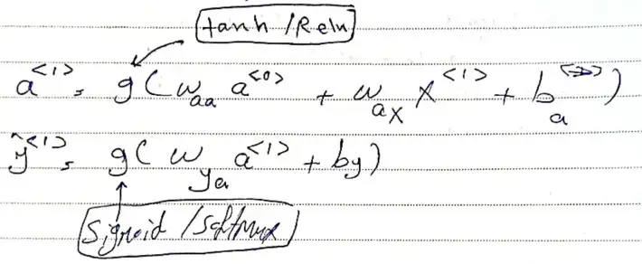
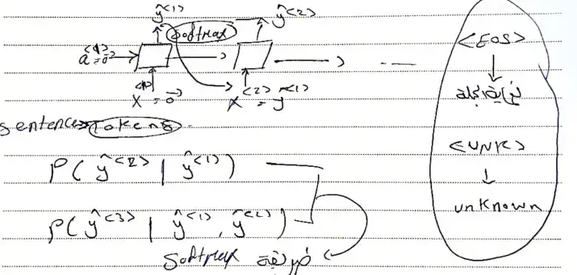
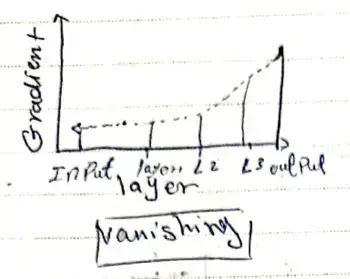
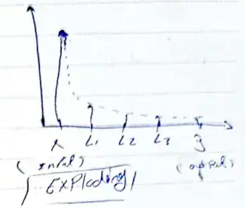
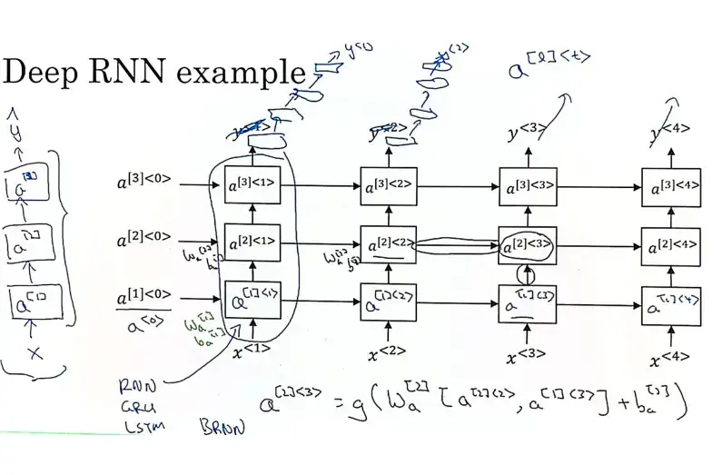

---
---
#ml_and_dnn 
### what is sequential Model ? 
like speech recognition ( تسلسل من البيانات ) 
```python 
  x                    y 
sequence           sequence    => have the same length = DNA analysis
sequence            sequence    => havn't same length  = speetch recognition
sequence            Not sequence    => sentiment anaylsis 
Not sequence        sequence 
```

**Notation:** 
$x^{(i) <t>}$  = >(i) تشير الي عنصر في المثال 
$T^{(i)}_{x}$ => (i) تشير الي طول التسلسل في المثال 
و يتم تمثيل  x-> y من خلال قاموس الكلمات في مثال : NameEntity ، Supervised Ml models 

### RNN Architecture  Model 


**Forward Propagation** : 
share parameters (w,b) for each timestep 
- formation : 
	

**Back Propagation** : 
for update the weights  

### The diff types of RNN (encoder inputs )->(Decoder outputs)
1. many to one 
2. one to one 
3. one to many 
4. many to many (Tx = Ty ) OR (Tx $\ne$ Ty) 

###  Examples on RNN 

 **Language model and sequence Generation** 

**Sampling Novel Sequences**

### Vanishing Gradient Problems 
#### Vanishing (In Backpropagation ) 


#### Exploding (In Backpropagation)

Exploding Gradient problem can solve it by **gradient clipping**

----
### Gated Recurrent Unit (GRU) 
to solve problem of vanishing gradients 
C  = memory cell => تحتفظ بالكلام المهم ( لو الكلمة مفرد مثلاً او جمع )
$C^{t} = a^{t}$
$C^{,}{<t>}$ = $\tanh(w_{c} [\Gamma_{r} ~ a^{t-1} , x^{<t>}] + b_{c})$ => قيمة المرشح الجديد  
$\Gamma_{r} = \sigma(w_{r}[c^{<t-1>} , x^{<t>}] + b_{r})$ : بيحدد المسافة بين الجديد و القديم 
$\Gamma_{u} = \sigma(w_{u}[a^{<t-1>} , x^{t}] + b_{u})$ : بيحدد إذا كان المرشح يحل محل المرشح الحالي ام لا 
$C^{<t>} = \Gamma_{u} * C^{,}{<t>} + (1-\Gamma{u}) *c^{<t-1>}$ : القيمة النهائية  

----
### Long-short term memory (LSTM) 
$C^t \ne a^t$ => GRU علي عكس ال 
$C^{,}{<t>} = \tanh (w_{c} *[a^{<t-1>} , x^{<t>} + b_{c}]$
$\Gamma_{u} =\sigma(w_{u} *[a^{<t-1>} , x^{t}] + b_{u})$
$\Gamma_{f} =\sigma(w_{f} *[a^{<t-1>} , x^{t}] + b_{f})$
$\Gamma_{o} =\sigma(w_{o} *[a^{<t-1>} , x^{t}] + b_{o})$
$C^{<t>} = \Gamma_{u} * C^{,}{<t>} +  \Gamma_{f}* c^{<t-1>}$
$a^{t} = \Gamma_{o} *c^{<t>}$ 

---
### Bidirectional RNN 


----
### Deep RNNs 
RNN : single layer , captures simple pattern , limited in capacity . 

Deep RNN : multiple layers , captures complex patterns more powerful . 


