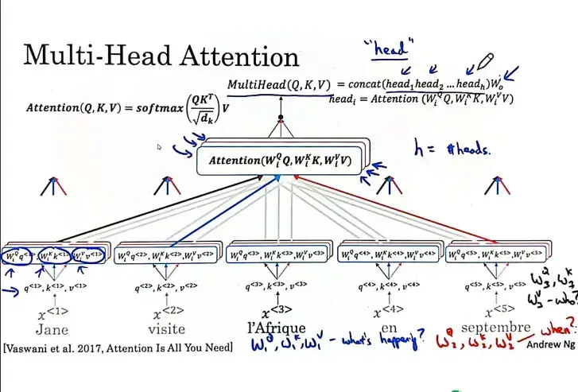

---
---
#NLP 

يمكنه القيام بالعمليات الحسابية علي التوازي (يعني اخد الجملة كلها مره واحده بدلاً من كلمة كلمة من اليسار الي اليمين ) 
Transformer Model = Attention + CNN (Parallel)

### Self Attention 
Parameters : 
V : value = $w^v .x$ => q , k بيخرج بالتمثيل الناتج عن 
Q : query = $w^q .x$ => what happen there 
K : key  = $w^k .x$=> ينظر في كافة الكلمات الاخري لمعرفة اي كلمة تعطي المعني الاقرب 
**SoftMax Equation :** 

$$
A(q , k , v) = \sum_{i} \frac{\exp(q.k^{(i)})}{\sum_{j} \exp(q.k^{<j>})} . v^{(i)}
$$

### Multi-Head Attention 
calculate multiple sets of attention  
و في كل مره بنغير صيغة السؤال (q) ( تي حدث ، ماذا حدث ، من فعل ذلك ) و ده بيدي تضمين اقول و احسن من مجرد عمل Word Embedding للكلمات . 

