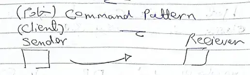
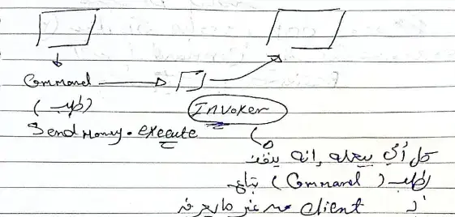

---
tags:
  - Software/Design-Pattern
---

---
in the first scenario when the receiver make a command from the client the client send it by self . 

when the number of code or commands more , this is not good for implementation and extends ,we can solve this by using the invoker for execute  the command that get it from client for the reiver 

و ده كله من غير ما يعرف الي جوه (الهدف هو عمل decoupling) عشان الكود عند ال client ميكبرش و بالتالي ده هيسهل ال Testing . 

## العيوب
كل command عبارة عن object و ده بالتالي بيكتر عدد ال Classes في الكود 

ال DP في اغلب الاحيان مش بيجي لوحده لازم يكون معاه DP تاني ، و ده بيخليك لازم يكون عندك دراية عن ال DP التانين . 

بيخل بمادئ ال [[OOP]] و ده لان ال command يعتبر بقي عنده معرفه بخصوصيات ال receiver  . 

