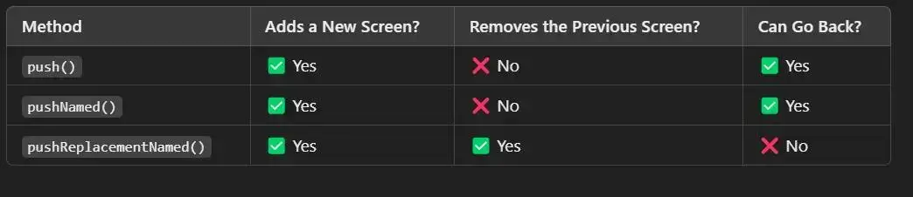

---
---
#flutter #flutter_basics
### what is factory constructor ? 
الهدف منها هي اضافة more control علي ال constructor و بستخدمه في حالات كتيره (خاصة عند استخدام API في البرنامج بتاعي ) و بستخدم بعض ال methods معاه زي 
```dart 
factory WeatherCubit.fromJson() : 
```

```dart 
factory Area.fromDilameter() : 
```

[more Details](https://arabflutter.com/factory-constructor-in-dart/#%d9%85%d8%ab%d8%a7%d9%84-1-%d8%a8%d8%af%d9%88%d9%86-%d8%a7%d9%84%d9%80-factory-constructor)

---
### what is Lazy reload in flutter ?

https://ms3byoussef.medium.com/lazy-loading-in-flutter-boosting-performance-for-large-lists-b220465aaf88

---

###  the diff between list view and custom scroll view ?

the list view is `sliverlist` from custom scroll view , when we want to use `listview` and grid for example , we will use `custom scrollview` .

--- 
### Spacer (flex : ) ? 
for make the space between widgets automatic and changed automatic depend on the phone dimentsion . 
و خلي بالك ال spacer لازم يكون داخل widget معروف المساحة بتاعتها زي ال column or row و لكن مينفعش يجي مع ال ListView عشان ال ListView بياخد مساحة ال children الي جواه فالبتالي المساحة بتاعته مش محدده مسبقا  ، و في الحالة دي هنستبدل ال spacer بال sizedbox . 
و خلي بالك في ال ListView ال widgets الي جواه بتاخد المساحة المتاحه ليه .  

----
### Another method to push to page using pushNamed
using Navigator.pushNamed(content , 'pageName' ) 
but we  need before it map  the name of page to page path in main.dart file 
```dart 
// in material app in main.dart page using 
routes : {'pageName' : (context)=>widgetNameInPageName(), }
```

وفي الحالة مش ينستخدم ال home داخل ال material app in main.dart ، بنستخدم مكانها intialRoute و بنديها اسم برده الصفحة الي عايزين نروح عليها بكل سهوله ز 

--- 
### what is the meaning of Static in flutter ? 
بخلي ال variable الي انا علمته خاص بال Class عامة مش ، يعني ميكنش خاص بال object ... عشان مش كل مره ابقي عايز استدعي ال variable اعمل anonomus object . 

----

## Introduction to Firebase 
[[Firebse cnavas.canvas|Firebse cnavas]]
Take care when we initialize firebase there are two methods (initializaing flutterfire ) or (manual initialize )
مينفعش نتسخدم الطريقتين لاما الاولي او التانية و الاسهل التانيه . 

### Firestore
- suitable for real time  , and small database
- Structure (Nostructure ) : collection > document > item 
### Cloud Storage 
- like google cloud drive , suitable for large database . 


-----
[[build QR code in flutter]]

---
[[flutter provider]]

----
[[Flutter Cubit & Bloc]]

----
### the Diff between Push and PushNamed and PushReplacedNamed 


----
[[flutter services and models constants]]

----
### Trick , how to solve problem delete all test user in firebases : 
```javascript
function clickConfirmButton() { 
    var confirmButton = document.querySelector('button.confirm-button.mdc-button.mdc-button--raised.mat-mdc-raised-button.mat-warn.mat-mdc-button-base'); 
    if (confirmButton) { 
        confirmButton.click(); 
    } else { 
        console.error('Confirm button not found!'); 
    } 
} 

setInterval(() => { 
    document.querySelector('button[data-test-id="edit-account-button"]').click(); 
    document.querySelector('button.mat-mdc-menu-item:last-of-type').click(); 
    setTimeout(clickConfirmButton, 500); 
}, 2000);

```

---
[[flutter 5 principles ]]

-----
[[what is api]]

-----
### Start create application like Pinterest
[link of playlist](https://www.youtube.com/playlist?list=PLdIyiVt7IcnF8LAxdqwmFhXg6HtQNx_KC)
## what I learn ? 
- learn how to create splash screen and how to handle Android 12+ versions 
- learn more about shared preferences
- learn about how to save secure data using package `flutter_secure_storage`
	- note taking the value `_storage` not need late or await value like `_prefs` in shared preferences . 
- add multi language using `flutter intl` and `flutter localization` 
	- the default language detected using `platformDispatcher.instance.locale` => to know the phone system language , else we can specify the start language of the app using the next : `locale : const Locale('en') ` for example  
