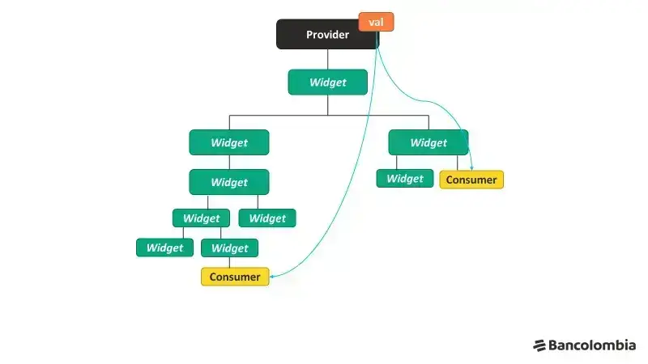

#flutter #flutter_statemanagement #flutter_provider



## Provider Component 
### ChangeNotifier() 
بنستخدمها اثناء عمل ال Provider Controller 
### ChangeNotifierProvider() 
بنستخدمها فوق ال Widget root عشان يسمع في ال Widget children .
### Consumer() 
ده الي listener to the provider . 


```dart 
Consumer(
builder : (context , providername , widget(optional)) {return } 
)
```

take care : make the location of Consumer be not the same location of ChagneNotifierProvider() 
عشان مينفعش اسمع ل   widget لسه متبنيتش عندي اصلا 