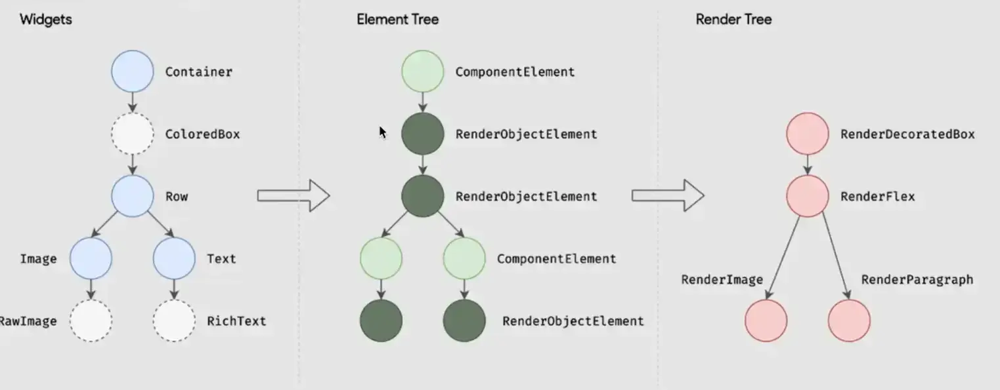

link: https://www.youtube.com/watch?v=xiEpasxIBzU&list=WL&index=65

#flutter #flutter_architecture 
related : [[Flutter Framework Architecture]]

-----

- there are three main topics (trees) 
	- Widget 
	- Element Tree : 
		- هو المسؤول في حالة ان ال object  او اي حاجه محتاج يتعملها rebuild . 
	- Render Tree : هو المسؤول عن اي حاجه بتتعرض علي الشاشة 

- كل حاجه في فلاتر ليها اكيد Element object و لكن مش شرط يكون ليها Render object  
- كل حاجة في فلاتر بتعمل Extend من Widget class يعني حرفيا كل حاجه في فلاتر عبارة عن widget 