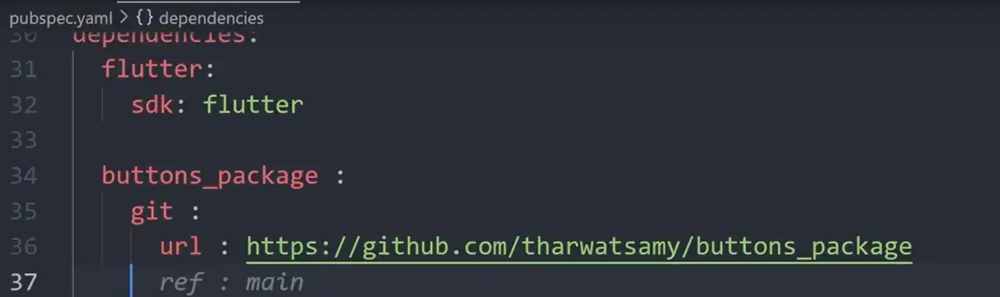

و بعد ما تعمل ال package بتاعتك و تعملها export و ترفعها علي Github مثلا 

هتستخدم الكود ده مثلا عشان تعمل import لل package بتاعتك في كود جديد مثلا ، و خلي بالك انت بتكتب اسم ال package الي موجود عندك في ال pubspec.yaml الي في ال package بتاعتك . 