#maharaa 
# chapter (1) - Database Foundation 

- file base system in the first (bad) 
- database system ? 
	- what is database : A collection of related data 
	- what DBMS ? : software to facilitate the creation and maintenance of a computerized database 
	- database system ? is a DBMS together with the data itself . (software + database ) 
- main component of database system ? 
1. User interface application program 
2. DBMS (queries + access and store to/from database )
3. database (meta data + stored database )
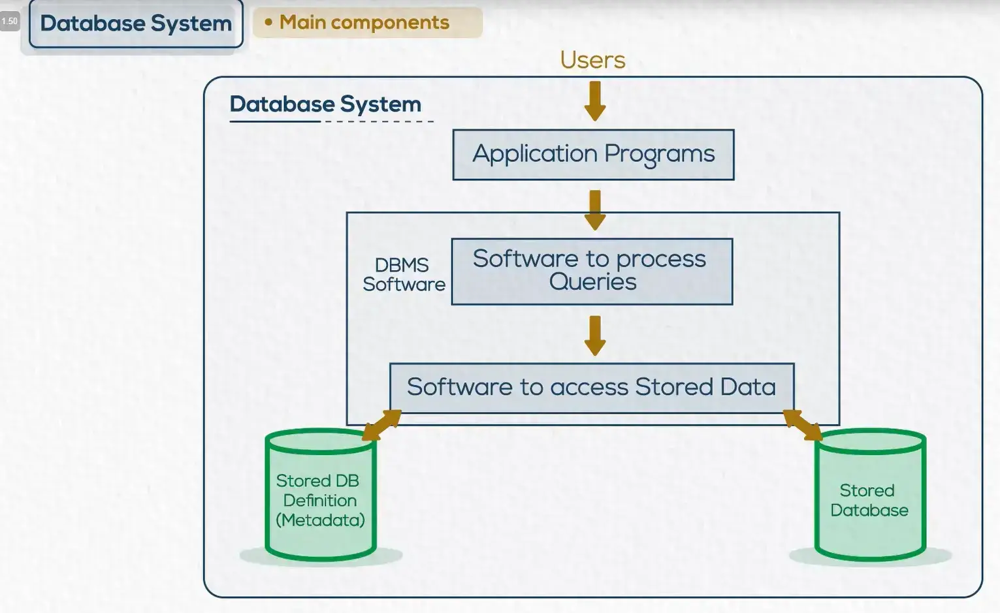

- database users (lifecycle) ? 
1. analysis and requirement gathering (size of the database , rate of growth , the balance of money and so on ..  ) => role:(system analyst)
2. database design (create database models and objects ) => role : (database designer)
3. implementation (install DBMS) and create database schema and privilege and authorized userss   => role : (database Administrator)
4. application development=> role : (application programmer )
5. End user (use the database system )
- DBMS architecture (three schema ) ? 
	- External schema 
	- conceptual schema (database structure/tables and relation between databases ) = the logical model 
	- physical schema (the allocation of database on the disk ) = the physical model 

- ليه عملنا ال architecture بالشكل ده ؟ 
	- for data independency 
		- يعني التغيير الي بيحصل في ال layer الي تحت مش بالضرورة تأثر علي ال high level layer 

- data models 
	- logical data model (conceptual) 
	- physical data model 

- Mapping 
	- the process of transforming  the requests and results between levels 

- database Environment 
	- centralized database environment 
		- mainframe environment
			- the processing depend on one server 
			- و لو مستخدم حاجه باظت عنده بالتالي هتبوظ عند كله 
		- client / server environment (two tier architecture)
			- database server <-> thick client 
			- خليت ان لكل مستخدم نسخة خاصة بيه و بتسمع و بتستقبل من database server واحد برده ، بس حليت مشكلة ان لو مستخدم خصله مشكلة معينه ميأثرش علي باقي المستخدمين 
		- internet computing environment (three tier architecture )
			- database server <-> application server <-> thin client 
			- بقيت بدل ما اعمل application server لكل مستخدم لا ثبته واحد برده ، عشان لما يحصل تحديث في ال application server مبقاش مضطر اني احدثه عند كل المستخدمين 
	- Distribution database environment
		- replication 
			- types : 
				- full replicate 
				- partial replicate 
			- copy/paste database 
		- fragmentation 
			- cut/paste database 

----

# Chapter (2) - Entity Relationship Modeling (ERD)

- ERD 
	- بيعرفني العلاقات ما بين ال Tables او ال Entities و بعضها ، 
- what is Entity ? 
	- any object has characteristics or attributes 

- Build ERD (Conceptual Design) 
	- Entity
		- Strong Entity 
		- Weak Entity 
			- معتمده اعتماد كلي علي Entity تانيه زي ال dependent معتمده بشكل اساسي علي emp entity 
			- مقدرش احددلها ال unique key خاص بيها يميزها عن باقي ال entities 
			- بنعرف ال weak من خلال اننا بنحط double rectangle ليها . 
	- attribute 
		- single attribute (have the one value ) like National Identity number 
		- Multi valued attribute (have multiple value) like phone number 
		- composite attribute (the attribute is divided into small subparts) like address is divided into (zone , street) 
		- Derived attribute (can be calculated from another attribute or entity) like calculate the age from the date of birth
- Relationship 
	- Degree of relationship 
		- عدد ال entities المرتبطه 
		- types : 
			- Binary relationship 
			- unary / recursive relationship 
			- Ternary relationship
	- cardinality ratio 
		- the maximum number of relationship 
		- يعني مثلا هل الموظف الي عندي ممكن يشتغل في ادارة واحده ولا في اكتر من ادارة ؟ 
		- types : 
			- one - one 
			- one - many 
			- many - many 
		- in Ternary relationship each branch in cardinality must be equal 
	- participation 
		- بتبقي عكس ال cardinality ratio 
		- the number of minimum relationship 
		- types : 
			- must (double line)
			- may (single line )
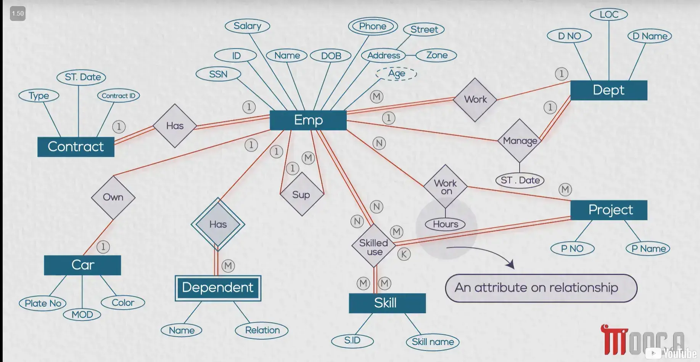

----

# Chapter (3) - ERD Mapping to Tables 
- relation database (logical design)
	- Tuples (rows)
	- column 
	- intersection tuple with column (domain) and must have single value 
	- primary key 
		- must be unique 
		- can't be have null value 
- build relation database from ERD Model (conceptual Design)
	- Mapping Strong and Weak Relationship 
		-  each entity is a Table 
		- each Attribute is a column in the Table 
		- when convert the multi value attribute (we separate the the attribute in new table and take  forignkey from the first table )
		- the derived attribute (calculated attribute) not store it in database , cause headache to the database 
		- to mapping the  weak Entity , we take the primary key of the owner entity as a forignkey  
	- Mapping Relationship Types 
		- binary/unary 1:N 
			- take the primary key in the one side and pass it to the many side as a forignkey 
		- binary / unary M:N
			- بعمل جدول جديد خالص في ال primary keys of two tables as a forignkey 
		- binary / unary 1:1
			- may - must 
				- take the primary key of may side as a forignkey in must side 
			- may - may 
				- بناخد اي primary key من الاتنين او احطه عند التاني كـ forignkey ، او ممكن اعمل table جديد احط فيه ال two primary key of two tables بس الحل ده مش افضل حاجه 
			- must - must 
				- بدمج الجدولين في جدول واحد و بعدين بشيل الجداول القديمة
		- Ternary relationship 
			- بعمل جدول جديد و بحط فيه ال three attributes as a forignkey 

- what is the meaning of Headache ? 
	- في مثال ال Age في كل مره هاجي استدعي ال Age هيعمل calculate عشان يحسب القيمة و ده بدوره بيبطأ عملية ال retrieval لل database  

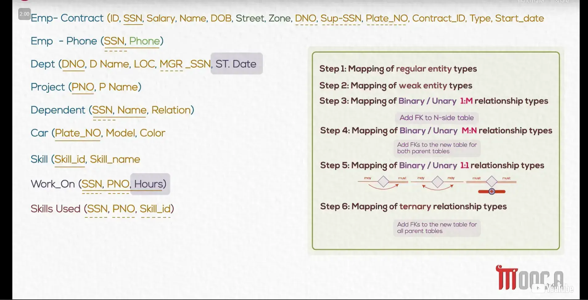

---

# chapter (4) - Structured Query language SQL 

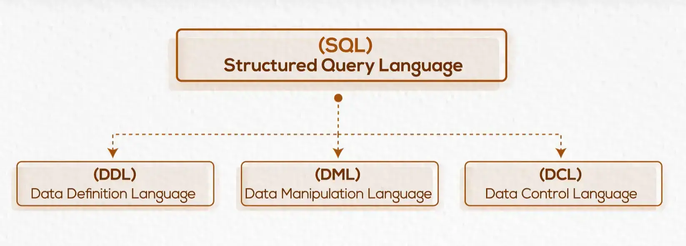

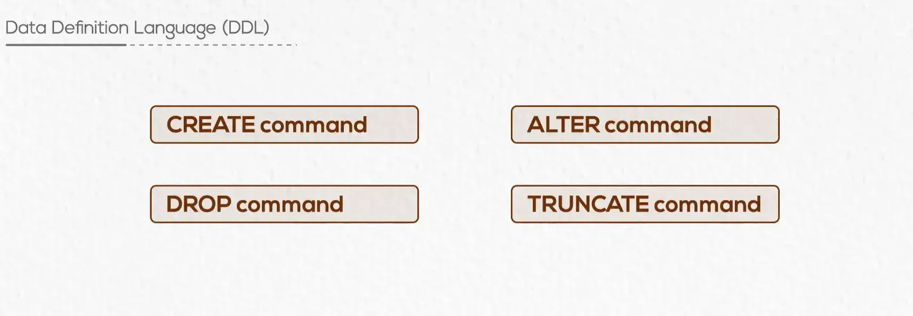

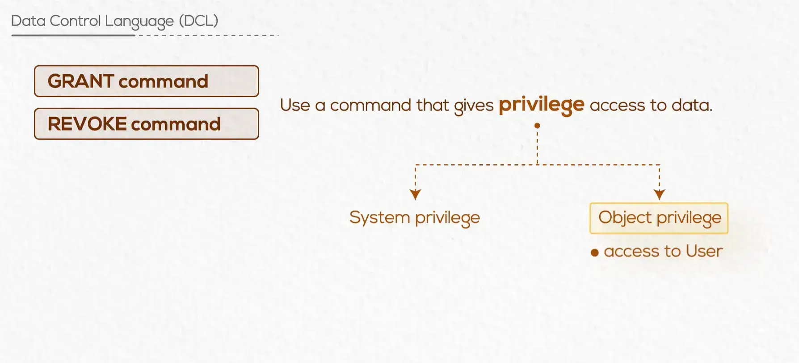

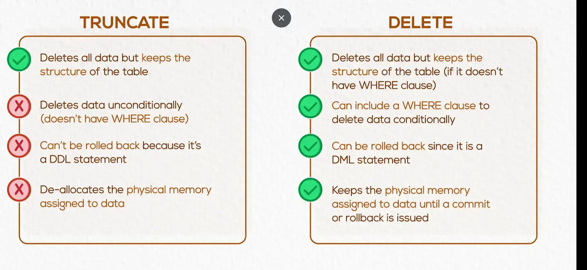

----

# Chapter (6) - SQL other database objects (view , index)
- View (logical Table)
	- عبارة عن  نافذه بظهر فيها الحاجات الي عايز المستخدم يشوفها بس من غير ما اخليه يخش عندي علي الداتا  بيز ، اعتبره زي pointer بيشاور علي الداتا من الداتا بيز ، و بناءا علي ذلك ممكن في ال view اعمل نفس عمليات ال DML من تعديل او ازالة وهكذا و ده بيتم من خلال ان ال view بيروح علي الجدول الاساسي و يعدل عليه بنفسه . 
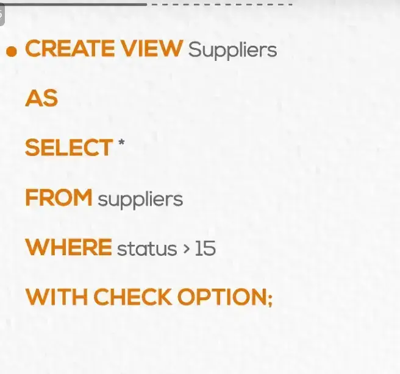

- عملية ال with check option هو عبارة عن اني بقوله اي عملية insertion هتم من ال view مش هتحقق الا لو الشرط بتاع ال where ده متحقق .  
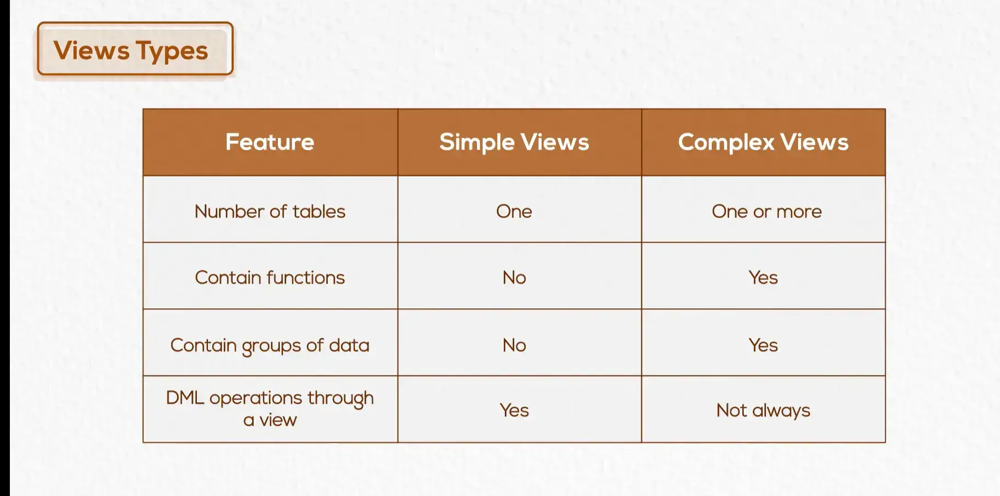

- Index
	- the database is unsorted and scattered (distrusted in the physical storage) => so the main function of indexing is fast retrieval of data from database , but overhead on DML (insert , delete , update ) because the manipulation applied on the file data and file index also . 
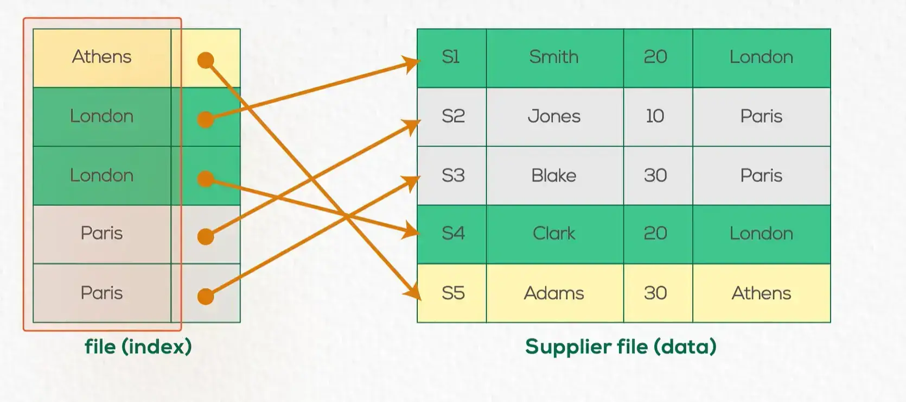

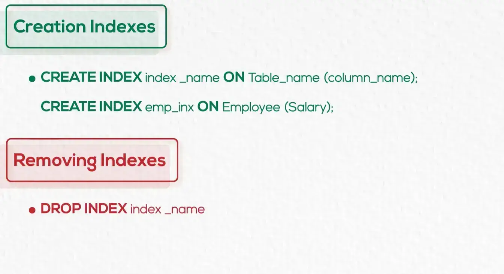

-----

# Chapter (7) - Normalization of data 

- what is Normalization of data ? 
	- is the process take the database through a series of tests (Normal forms) for minimize the redundancy and insert , update and delete anomalies and frequent null values 
	- Normalization solve the problems in the database by divide the table into many tables 
- functional dependency 
	- value of A uniquely determines the value of B 
	- types : 
		- fully
		- partially 
		- transitive 
- Normal form (is sequential `1NF -> 2NF -> 3NF` )
	- fist normal form 
		- ❌multiple values attribute 
		- ❌composite attribute 
		- ❌repeating group 
	- second normal form 
		- ✅achieve first normal form 
		- ❌partial dependency (not key attribute depend on part of primary key)
	- third normal form 
		- ✅achieve second normal form 
		- ❌transitive dependency 
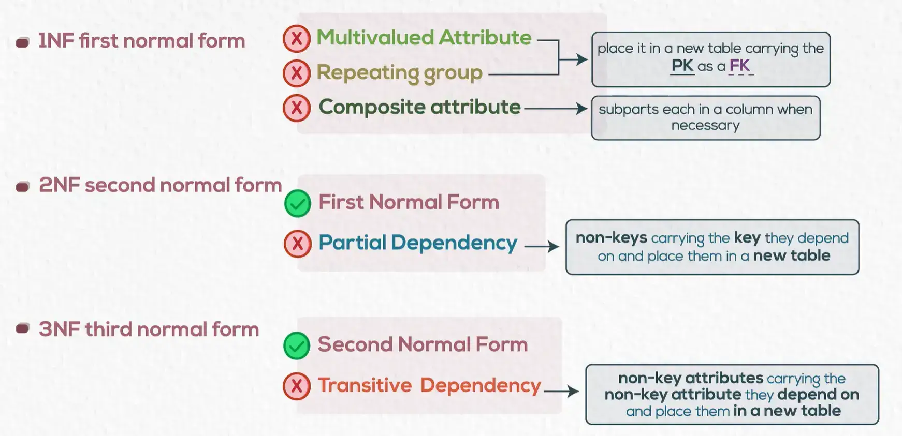

