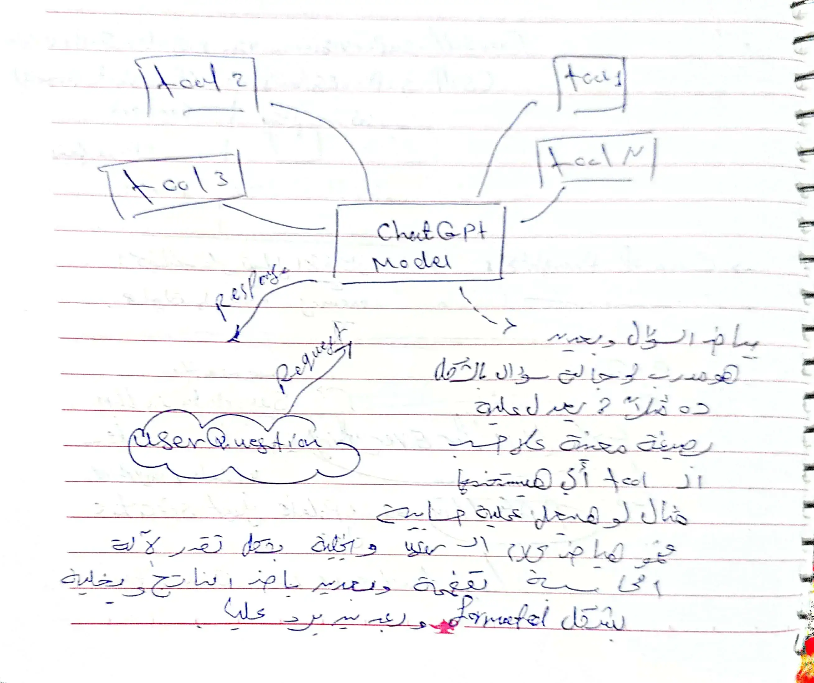

---
---
#llms #thoughts 

- في عملية training the llm ، في ال pdf المرفق كان بيقول اننا بنعمل compress للـ chunk of 10TB of text الي 140 GB .... الفكرة هنا بقي ان في طبيعة الحال في عملية ال compressing احنا بنعمل compress من غير فقط للبيانات ، و لكن هنا بقي احنا بنسمح بعمل فقط لجزء من البيانات ... فانا الي بنعمله بالفعل هو عملية تغيير بسيط لشكل ال Text مع تعديلا اخري . 
----
عملية predict the next word مش بسيطه زي ما احنا متخيليين ، في معقده جدا  ، ممكن تفكر في ال parameters كـخدم للموديل و مطلوب منهم انهم يتبؤ بالكلمه الجايه ايه ، فلازم يكون علي دراية مثلا لو المهمه التنبؤ في سياق الكلام عن شخصية اثرية فلازم يكون عندهم دراية بالشخصية دي و ايه هي و طريقة التنبؤ فالعملية في ظاهرة تبان بسيطه و لكن في الواق هي معقده. 

----
عندنا في الـ training اكتر من مرحلة : 
1. pre-training => make the model can predict the next word 
في هذه المرحلة نفضل الجودة علي الكمية لانك بطبيعة الحال بتجيب داتا من الانترنت ، فمش شرط تكون جودتها عاليه (المقصود بالجوده المعلومع مثلا مش شرط تكون صحيح ، او مش بالشكل الي احنا عايزينه)
2. fine tuning training (Assistant Model) => keep the optimizable model and change the document dataset to manually datasets 
و لكن بقي في المرحلة دي انا بنفضل الجوده علي الكمية 

---
يبقي بشكل ملخص كده لعملية ال training الي بتحصل لل llm هي : 

اثناء عملية ال evaluation في حال وجدت انه الموديل بيطلع اجابه غير منطقية فانت بتشوف ايه الاجابة الصح و بعدين بتدخل السؤال بالاجابة الصح كـ Q&A  للداتا سيت بتاعتك و بعدين تعيد عملية ال fine tuning 

---
- فيه مرحلة تالتة من عملية training the model بنعمل فيها عملية مقارنة ما بين الاجابات الموجوده بالفعل بدلأ من جعل الموديل generate و اختيار الافضل و بعدين اخش تاني في عملية ال fine tuning ، و في Open Ai بيسموا العملية دي بـ Reinforcement from human feedback اختصاراً RLHF 
-----
فيه chatbot arena و ده بيستخدم ELO و هي شبه الشطرنج و الهدف من الموديل ده انه يعتبر الموديلز الي موجودين علي الساحه اكنهم في لعبة شطرنج لحد ما يوصلوا لـ الفائز الاول و بعدين التاني و هكذا . 

---

---

