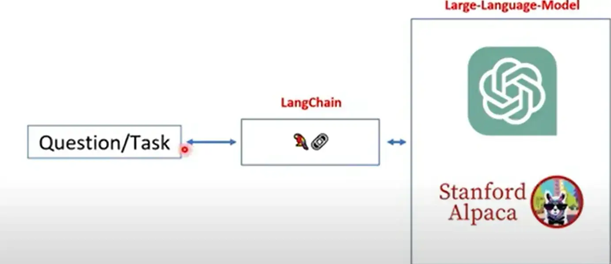
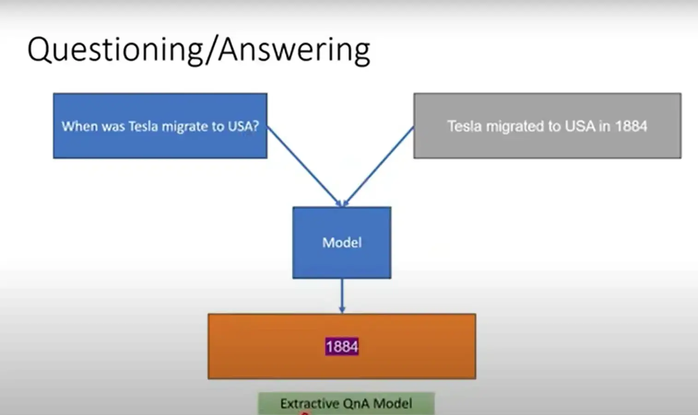
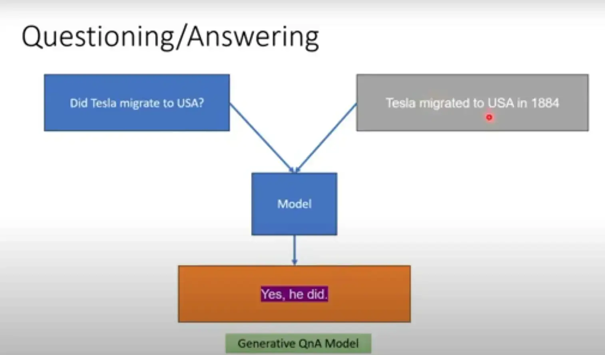
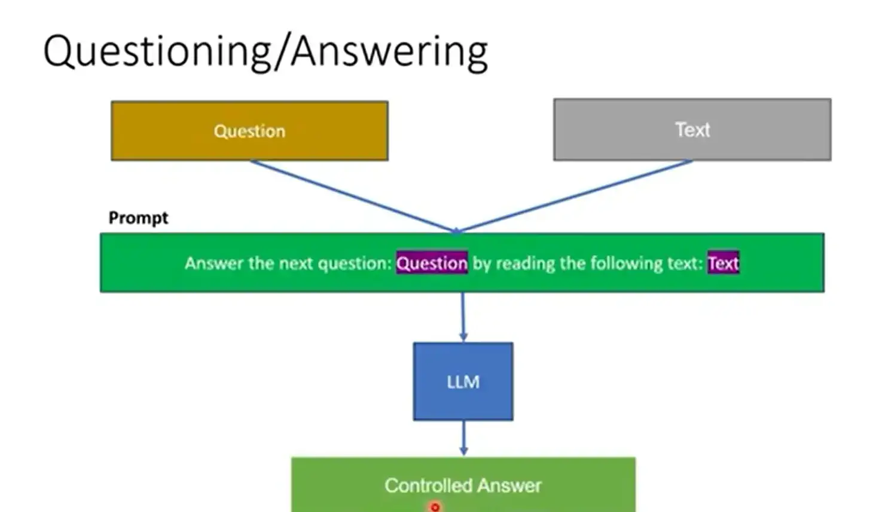
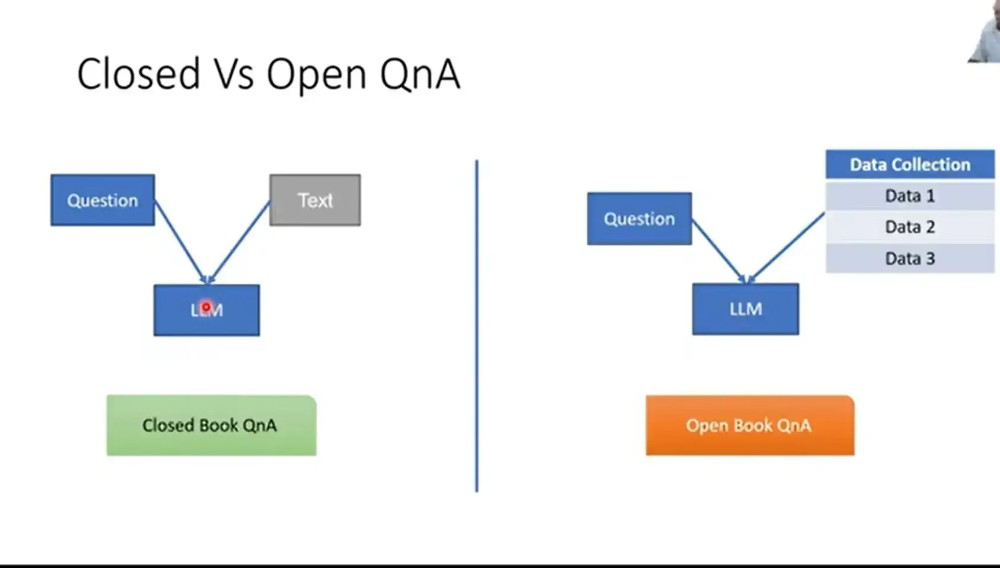
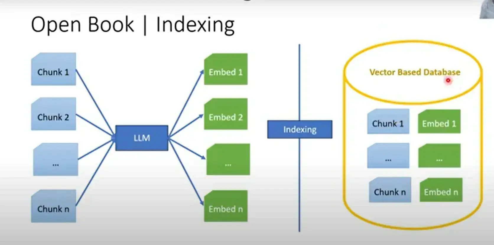
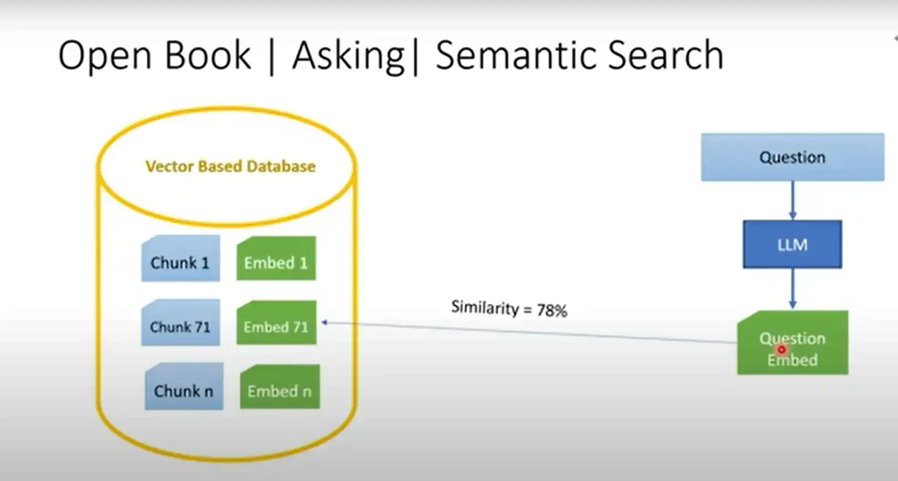
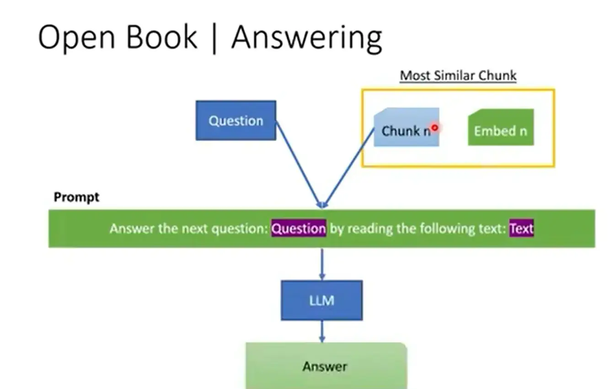

---
---
#NLP #NLP_prompt_engineering 

----
# large language models (LLMs)
بيتم عمل الموديل علي اكتر من مرحله ، و الاختلاف في كل مرحله عن التانيه في نوع البيانات الي بديها للموديل (raw data ) : 

### 1. supervised learning - predict the next word 
**Raw data -> Train -> Base Model** 
و في المرحلة دي ببدأ اعلم ال model انه يتوقع الكلمه القادمة و النتيجة في الاخر هبقي عملت base model ، و الي بيقدر يطلعلي كلام منطقي و مكتوب بشكل صحيح ، و لكن في نفس الوقت بيبقي اجاباته  مش هي الي انا عايزها يعني ميقدرش يقوم بتاسكات (زي ما تقول كده علمته بس ازاي يتكلم و لكن لسه معلمتوش ازاي يحلل بقي الكلام و يفهم الغرض من السياق ايه و يقوم بالمهام الموجهه اليه ) 

### 2. supervised learning - follow the instruction 
بنجيب داتا عبارة عن questions and answers  وبتبقي مكلفة عشان الاجابات محتاجه خبراء عشان يقدروا يجاوبوا بشكل دقيق و سليم . 
**instruction data -> base model -> finetuned -> instruction tuned LLM** 

----
### Tokenizer 
عبارة عن جدول او index فيه كل كلمه قصادها رقم خاص بيها (ID) ، طبعا مش بيبقي فيه كل الكلمات الي في الدنيا و لكن بتبقي الكلام منتقاه بعنايه و الجدول ده بيختلف من موديل للتاني   و بستخدم الجدول ده عشان عملية ال encoding and decoding عشان الموديل مش بيفهم الا ارقام و مش بيطلع برده الا ارقام . 
و فيه ملحوظة تانيه مهمه و هي ممكن يكون حجم ال input بعد ما يتعمله tokenization يكون اكبر من حجم ال input الفعلي ، لانه لو في كلمه في input الاصلي مش موجوده عنده في tokenize table هيبدأ يتصرف بالموجود في الجدول من خلال انه يبدأ يقطع الكلمه دي الي اجزاء اقل مثال : 
going => go + ing 
و هكذا بقي مع كل الكلمات الي مش موجوده بالظبط زي ما هيا عنده في الجدول بيبدأ يقطعها الي اجزاء اكتر لحد ما يلاقي الجزء ده عنده في الجدول . 

# Langchain framework 

وظيفته ان يعدل من شكل ال prompt او ال input بتاعك (retune) ، بحيث يشيل الاجزاء الي مش مهمه و يفهم الموديل بشكل دقيق السؤال بتاعك ، و كمان بيعدل من شكل ال output الي بيظهرلك بحيث يبان اكثر منطقية و واقعية . 
يعني من الاخر ال langchain بـ generate instruction معينه تجبر ال llm انه يغير من طريقة ال response بتاعته فبالتالي يسهل علي ال langchain انه يفككها و يحولها لصيغها الي احنا عايزينها .  

### Few shot learning 
معناها بكل بساطة اني لو اديت الموديل بتاعي بعض الامثلة هو بشكل تلقائي هيعرف التاسك من غير ما تقوله عليها . 

### output parser 
شكل المخرجات ممكن يكون مختلف يعني انا دخلتلك text كـ input  ولكن عايز ال output يكون list او اي فورمات تانيه غير ال text  . 
فاحنا بنستخدم ال Langchain عشان نقدر نتحكم في شكل ال output بتاعنا . 

### Extractive QnA models 
give the model (question and text ) =>  predict the  Answer 

و هنا لازم الاجابه الي انت عايزها موجوده من ضمن النص الي انت حاططهوله . 
### Generative QnA models 
نفس الكلام في  Extractive qna model و لكن الفكره هنا بقي ايه ان الاجابه بتاعة ال model بتكون مبنية علي اساس فهم الموديل نفسه للنص ، يعني الاجابة ممكن تكون yes or no اعتمادا علي فهم الموديل للكلام الي هو واخده مش مجرد يطلع الكلام من النص وخلاص مثال : 

----
لذلك فإن الصيغة الافضل في التعامل مع chatgpt models هي كالاتي : 

----
و ده يقودنا الي نوعين من ال QnA models : 

----
#### how to solve problem open QnA 
زي ما قولنا احنا هناخد الداتا بتاعتنا مش من مصدر واحد لأ احنا هيبقي عندنا data collection و المفروض نشوف ايه الداتا القريبه من السؤال بتاعنا ، لذلك لازم نقوم بخطوات عشان نقدر نساعد الموديل في تحديد الاجابة الي المستخدم عايزها من خلال عدة خطوات : 
##### 1. parsing 
بنبدأ نقسم الداتا الي داخله الي chunks مناسبه للموديل بتاعنا و برده نشيل ال chunks المتشابها 
##### 2. indexing 
بعد ما قطعنا الداتا الي chunks مناسبه يقدر الموديل بتاعنا يقوم بالعمليات عليها ، عايزن في الاول اننا نديها position عشان نقدر نستدعيها ، و ده بيتم بعد ما نقوم بعمل embedded (vectorization ) ندي معني رياضي لكل chunk عشان الموديل مش بيفهم الا علاقات رياضية  ، و بعدين يخزنها في داتا بيز . 

##### 3. semantic search 

بدل ما كنت بقوم بالبحث التقليدي العادي الي هو بيعمل بحث و يشوف هل الكلمه دي موجوده ولا لأ ، بقيت ابحث من خلال ال Embeddings الي الموديل عملها و بعد لما يجيلي سؤال اعمله embedding و بعدين اشوف مقدار ال similarity ما بين السؤال و ال chunks الي موجوده عندي في الداتا بيز بالفعل باستخدام اي وسيلة لقياس ال similarity زي مثلا cosine similarity  و من خلال الخطوه دي اقدر اشوف مين اكتر chunk مناسبة و قريبة من السؤال بتاعي . 

##### 4. Answering 

