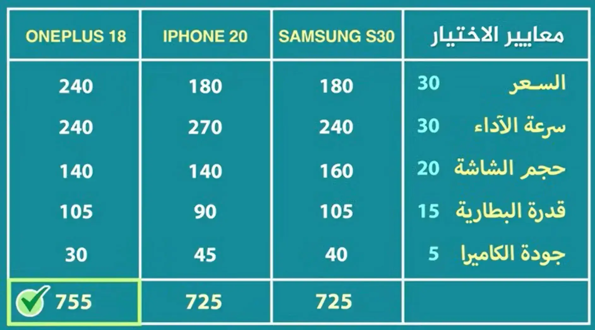

---
---
#awareness

-----

# الفصل الاول : لماذا نختار ؟ 
## معضلة كثرة الخيارات 
1. سبب في الحيرة و الضغط النفسي ( شلل التحليل analysis paralysis )
2. كثرة الخيرات زي ما بتزيد فرصتك في ايجاد خيار مناسب كذلك بتزود فرصة إنك تقع في احتمالية انك تقع في اختيار خاطيء 
3. القفز بين المسارات بدلاً من الاستمرار و المثابرة في مسار واحد 
4. ممكن يكون كثرة الخيارات يمكن ان تكون وهمية 
5. تزيد من شعور عدم الرضا ، و إن كده فايتك حاجه . 
----
## انواع الخيارات و اصناف المختارين 
### انواع الخيارات / القرارات 
1. بسيط / تأثير ضعيف (زي مثلا شراء ملابس او وجبة علي الغداء ) 
2. معقدة / تأثير كبير (شراء لابتوب او مشروع معين ) 
3. مصيرية (الدين و العقيدة / الزواج / الهجرة الي الخارج ) 
----
### انواع الشخصيات في إختيار القرارات 

^ad5706

1. الراضون بأي نتيجة جيدة 
2. المتطلعون للافضل فقط (بيواجهوا الشعور بالندم بمعدل اكبر لانهم بيضيعوا علي نفسهم الفرص في انتظار الافضل ) 

> [!NOTE] 
> حل المشكلة من وجهة نظري هي بوضع المعايير البسيطه بحيث ان لم تتجاوز تلك المعايير الخوض في التجربة 

-----
# الفصل الثاني : مفسدات القرار / الاختيار

جزء كبير مهم من مهارات اختيار القرارات هو القدرة علي تجنب مجموعة الافكار المغلوطة و الانحيازات العقلية الي بتكون سبب في اختيار قرار خاطيء 

## تأثير المشاعر 
تأجج المشاعر يعطينا صورة غير حقيقة عن الواقع . 
### نصائح لتجنب تأثير المشاعر علي قراراتك 
1. لا تتخذ قرار وقت تأجج المشاعر 
2. انصح نفسك كصديق  
3. استخدم آلة الزمن !  ، هل المشاعر دي هتفضل مستمرة مستقبلاً . 
-----
## التفكير الثنائي (كلا القراران صعبان )
المقصود هو التفكير بصورة اما او (الاستمرار في الوظيفة او تركها ) 

كلا القراران صعبان بالرغم من ان هناك قرار ثالث جيد مثل الاستمرار في الوظية الاولي حتي بداية مشروعك 

### كيف تتجنب مغالطة التفكير الثنائي ؟ 
افترض ان كلا القراران غير موجودان ماذا سوف تفعل (لمحاولة التفكير في حل ثالث ) 

**الهدف ليس إيجاد حل وسيط و لكن توسيع نطاق القرارت الي انت وضعته لنفسك**(الوسط بين الحق و الباطل فهو باطل ) 

---
## فخ الحل الاوسط 

تذكر ان الحل الاوسط كما يمكن ان يجمع بين بعض مميزات الامرين احيانا ... فهو ايضا يجمع بين بعض عيوب الامرين غالباً 

لاحظ الفرق بين الحل الاوسط و الحل الثالث ، فالحل الاوسط يكون من نفس جنس الخيارات المتاحة بينما الخيار الثالث قد يكون حل مختلف تماماً . 

-----
## الانحياز التوكيدي 
أنك تنظر فقط للاسباب و الادلة التي تؤيد قناعاتك و تتجاهل اي ادلة اخري . 

### كيف يمكنك تجنب مشكلة الانحياز التوكيدي 
1. تتبني الخيار المخالف و دافع عنه ! (فهذا يجبرك علي تحليل الوضع بزاوية مختلفة)
2. دافع عن وجهة نظرك امام شخص مخالف 
----
## السير مع القطيع 
مفيش مانع من انك تختار الاختيار الشائع بين الناس و لكن بعد ما تقتنع بالدليل انو الانسب فعلاً . 
(اختيار الشائع عادة ما يكون اختيار عاطفي - تحديداً عاطفة الخوف -  و ليس عقلاني! )

ملحوظة 1 : شيوع منتج او خدمة معينة يعد ميزة في كثير من الاحيان ! ( و لكن هي في النهاية تعد ميزة واحدة فقط ) 

ملحوظة 2 : الامر الشائع بين الناس يتغير كل فترة من الزمن و لكنه عادة ما يتغير ببطأ 

----
## الحدس الكاذب 
**لا تجعل انطباعك الاول عن شيء ما هو العامل الفاصل في اختيارك !**

مثال : الي هو مثلا الراجل الي بيقول انا بقرر بقلبي لو حاسس اني مرتاح في القرار المعين ده هعمله و لكن في الحقيقة هو بيختار بعقله اللاواعي (الحدس) و الي ممكن يكون صح او يكون خطأ . 

----
## قرار الانسحاب 
مغالطة التكلفة الغارقة 
### كيف تتجنب تلك المغالطة 
حدد منبه للتراجع قبل البدء في اي مشروع او علاقة او مسار 
(المقصود بالمنبه للتراجع ه و ضع بعض العلامات التي لو ظهرت يبقي تتراجع عن ما تفعله و ممكن يكون صفات او تحديد وقت و مجهود و تقييم المشروع )

### نصائح تساعدك علي اتخاذ القرار الصحيح 

1. لو وجدت نفسك تتمني انك لو لم تدخل في هذا الامر من البداية فديه علامة تؤيد قرار الانسحاب 

2. لو وجدت نفسك تستمر بدون وجود خطة واقعية تمشي عليها و انك مستمر علي اساس حدوث شيء ما يحسن الامور فدية علامة تؤيد قرار الانسحاب 

3. لو وجدت ان احد اسبابك خوفك من الانسحاب هو خوفك من نظرة الناس ليك (فالافضل هو تقييم الموضوع بعيداُ عن صورة الناس في الموضوع ) 

4. مهم انك تفهم ان بعد فترة الحماس في البدايات الانتاجية بتاعتك هتقل هنا الانسحاب عادة بيكون قرار خاطيء او متعجل (هناك فرق بين ان المشروع يكون التقدم فيه ضعيف او ضعيف جداً و بين انه يؤدي الي خسائر يصعب تعويضها ) 

5. في مرحلة الزواج إن لم تتقبل الطرف الثاني علي حاله فلا تتم الزواج خوفاً علي ما استثمرته

6. استشر خبير (الهدف من الاستشارة ليس انك تنفذ الي هو شايفه صح ، و لكن الهدف هو إنه يلفت نظرك لامور انت مكنتش واخد بالك منها ) 

7. استعين بالخبير ( الله عز و جل ) و صلاة الاستخارة . 

---
## خدعة التثبيت / الارتكاز 
### نصائح لتجنب فكرة الارتكاز 
1. لا تشتري منتج إلا اذا كنت محتاجه فعلاً ، لا تشتري لمجرد ان السعر فرصه لا تعوض .. و لما تقرر الشراء شوف هل المنتج ده يستحق السعر ده بغض النظر عن سعره قبل الخصم (يعني قيمه  علي السعر الي عليه حالياُ ) 

2. وضع شخص اخر كمرجع  او نقطة ثابته بتقارن نفسك بيها ممكن يظلمك من ناحيتين ، الاولي إنك تُحبط لو لم تجد نتائج مماثلة بالرغم من ان ظروفكوا مختلفه ، و الثانية ترضي بنتائج اقل من امكانياتك لمجرد انها مماثلة لنتائج الشخص الي بتقارن نفسك بيه بالرغم من إن امكانياتك تسمحلك بتحقيق نتائج افضل ....  (فالافضل من كل ذلك هو انك تضع اهداف لنفسك حسب طموحك و ما ترغب من اثر في هذه الحياة و ما هو متاح من امكانيات بالنسبة لك انت )

3. حكمك علي شيء معين جيد / سيء .. حدد إيه النقطة او المرجع الي حددت علي اساسه حكمك ده . 

----
## تغيير المنظور (سلاح ذو حدين )

هو سلاح ذو حدين لانه يمكن يمكنك من ان تتخطي عقبات او ابتلائات , و كذلك يمكن ان يؤدي الي خداع نفسك . 

### كيف تستفيد من الفكرة و تتجنب سلبياتها 

1. استخدم (تغيير المنظور) مع العقبات و الابتلائات في النظر  للجانب المضيء لتجنب الاحباط 

2. احذر من خداع نفسك (بتغيير المنظور ) من اجل اتباع رغبة او شهوة خاصةة مثل شهوة الشراء ! 

3. اخذر من مخادعة الشركات ليك و هي بتروجلك خدماتها 

4. استخدام تدريب المناظير الخمس اي قرار منهم (العدو ، الحدس ، الحذر ، الشجاعة ، الموت  ) 
-----
## الخوف من النجاح 
هو خوف من التغيير الذي سيأتي به هذا النجاح علي حياة الشخص في شكل مسؤليات و التزامات جديدة 
(المطلوب هو دراسة الموقف بعقلانية و تكون علي دراية  أن عشان تتطور لازم تخرج من نطاق المألوف  و المريح )  

----
## مغالطة الانحياز للنجاح 
المقصود هنا هو التركيز فقط علي الحالات الناجحه  و ترك الحالات الاخري الفاشلة في اتخاذ قرار معين 
(عند اتخاذ القرار لا تركز فقط علي الحالات الناجحه فقط بل عليك ايضا التركيز علي الحالات الفاشلة و دراسة لماذا اصبحت فاشلة ) . 

-----
# الفصل الثالث : اساليب الاختيار و اتخاذ القرار 

## صلاة الاستخارة 
الصلاة تأتي قبل و بعد و اثناء اخذك بالاسباب 

---
## قلل من خياراتك 

### كيفية التقليل من الخيارات المتاحه بالنسبة لك ؟  
1. وجود مباديء و قواعد واضحة في حياتك . 

2. الاولويات 

3. الروتين (القرارات المحددة مسبقاً ) قرارات عن وعي ، اي  روتين مع الوقت يحتاج الي التحسين 

4. تبسيط الحياة (ما قل و كفي خير من ما كثر و الهي )

---
## اسلوب تخاذ قرار صعب 
1. تحديد القرار المتردد في اتخاذه 

2. هات ورقة و قلم و قسمها 3 اجزاء تحديد المخاوف و تجنب حدوث المخاوف و انقاذ الموقف 

3. اكتب توابع عدم اتخاذ القرار 
---
## اسلوب اختيار الافضل 

يفضل الا تزيد عن خمس معايير (درجة من 10 ) 

وزع 100 علي المعايير بعد التقسييم لكل من عنصر من 10 

---
## بين الصبر و التعجل 

تأخير القرار الصحيح قد يكون له نفس اضرار القرار الخاطيء , و قد يضيع عليك بعض الفرص ! 

### حتي متي تنتظر ؟! 

1. اختبار السعادة : اتخاذي لهذا القرار الان سيؤثر علي سعادتي لمد قد إيه . 

2. في حالة إن كان الخيارين جيدين (عقل القرار)

3. حدد نوع القرار المهم ... هل يسهل ام يصعب التراجع فيه . 

4. احذر من فخ البحث و جمع المعلومات (اتخذ القرار عندما يكون عندك قدر جيد و كافي من المعلومات ، و ذلك يأتي عند تكرار المعلومات امامك ثناء البحث ) . 

5. تذكر ان الوقت تكلفة يجب وضعها في الحسبان 
----
# الفصل الرابع : ما بعد القرار 

## التعامل مع الندم 

1. إذا اخذت بالاسباب و استخرت =  فالنتيجة غير الموفقه إما ان تكون ابتلاء انت مأجور بالصبر عليه ... و ما انه نعمة مغلفة بغلاف الابتلاء و ستدرك ذلك لاحقاً .... 

2. تقصير واضح في اتخاذ القرار = تعلم من خطئك .. ضع تركيزك علي ما هو قادم 

3. تذكر إن مفيش انسان معصوم من الخطأ 

4. البحث عن المنحه داخل المحنه 

5. فهم تأثير الاقتراب من الفوز = عندها يزداد الشعور بالندم إذا فشلت (بعد الاقتراب من النجاح)

---
## حكمة الادراك المتأخر 
فخ توبيخ نفسك عن حدث اختارته و تبين اشياء اخري فيما بعد 

### كيف اعرف اني اخذت بالاسباب و لم اقصر 
1. انت لن تستطيع الاخذ بكل الاسباب لانك انسان (ناقص) 

2. اذا كان هناك بعض الاسباب و انت عارف مدي اهمية اخذها و انت تكاسلت عنها (انت فعلا قصرت )

3. لو السبب ده مكنتش تعرف مدي اهميته او وجود سبب معين ، و لكن انت لا تعلمه (فهذا ليس تقصير) 
----
## لا تخدع نفسك بالنتائج 
الحكم بصحة القرار بناءً علي النتائج فقط  
**النجاح معلم سيء ، يخدع طلابه اكثر مما يعلمهم**

----
## الاحباط رغم النجاح 
لم يفكر في تابعات النجاح 
### كيف تتجنب ذلك ؟ 
1. التفكير في تابعات النجاح كما تفكر في تابعات الفشل . 

2. التوقعات غير الواقعيه (الانسان يألف الامور ... سواء كانت نِعم او ابتلاءات!)

لذلك لا تبالغ في التوقعات مع تفكيرك في التابعات المرغوبة يقلل من احتمالية شعورك بالاحباط 