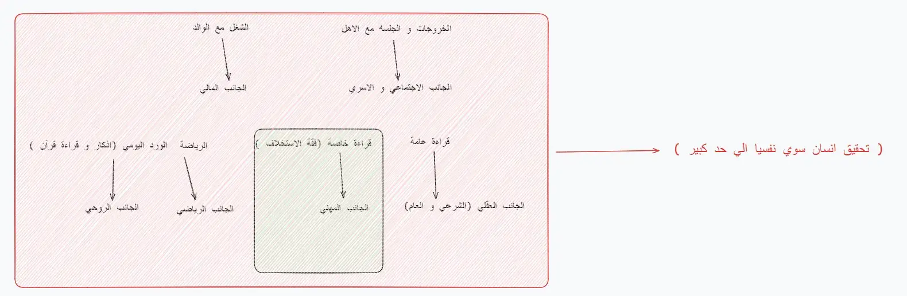

---
---
#awareness 
1. الورد اليومي (قراءة صفحة من القرآن مع تفسيرها +سنة الفجر + صلاة الضحي + اذكار الصباح + اذكار المساء )
2. الصلاة علي وقتها
3. قراءة عامة ( الله ثم انا و الاخرين )
4. قراءة خاصة ( فقه الاستخلاف )
5. الرياضة و الصحة

---

و عليك بـ :

1. قراءة النفس ( معرفة ما تريد و كيفية تهذيبها )
2. قبول النفس ( بعد ان عرفتها عليك ان تتقبلها كما هي مع العزم و السعي علي الاصلاح منها ما استطعت من قوة ) ويأتي ذلك بالعلم و العمل
3. تزكية النفس ( من علم استخلاف و ترويض النفس بدنيا و جسديا )

