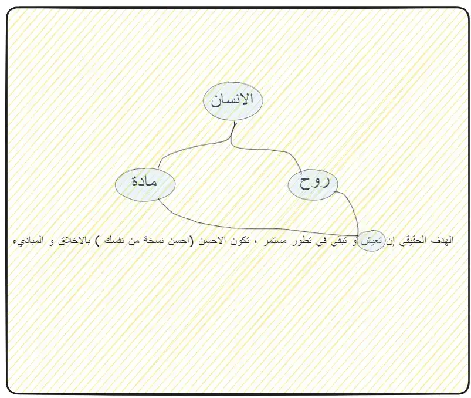

#source/Youtube #status/complete 
[[جلاس رووم]]

----
 - التقدم مش عكس المجتمع ، و لكن الرأس مالية عكس المجتمع " - محمد جودت 
	 - يعني مش معني إني متقدم (كدولة) في مجالات مختلفة يبقي انا عندي جفاء في الجانب الاجتماعي ، و الاسري و لكن المشكلة هنا في الرأس مالية الي بتدعم ان دائماً مصلحة الفرد فوق الجميع و نجاحي كفرد اهم من نجاح المجتمع. 
- العالم محتاج ايه الوقت الحالي ؟ 
	- العالم في الوقت الحالي محتاج ان يتحلي بالـ "الآدمية" (اسرتي - رياضة - عبادة - ...)
- نقطة الانصهار هي المرحلة الي بيوصل فيها بل يتخطي فيها الانظمة مستوي ذكاء الافراد . 
- "الهدف من الحياه هو كدبة عملتها إدارة الاعمال" - محمد جودت 
- لما تحب تحلل حاجه رجعها لصورتها البسيطة او البدائية 
-  
- الانسان الحكيم الي هدفه إنه يعيش بجسمه و روحه معاً لما جسمه ينتهي زايا يكمل في الحياة الآخرة (دار البقاء) و ده بيتحقق بإنك تنجح و تطور من نفسك 
- "إن الله يحب إذا عمل احدكم عملاً ان يتقنه"
- الي فهمته إن الهدف الحقيقي هو إنك تحاول تكون احسن نسخه من نفسك عشانك و عشان غيرك (لمبة تضيء للآخرين ) ، السيرة هي الي باقية 
- مفيش حد في الدنيا مش هيتعرض للاختبار ، لازم هيتعرض لاختبار 
	- الاختبارات انواع (صبر ، طرف)
	- اما الصبر فميش حاجه في ايدك تقدر تعملها 
	- اما الطرف فده الي بتروح و تيجي و تحاول فيه و بينقسم الي نوعين : 
	- اختبار الهدف منه التغيير (تغيير المسار)
	- اختبار الهدف منه انك تتعلم 
- "عسي ان تكرهوا شيئاً و يجعل الله فيه خيراً كثيراً"
- "إن انا ممكن اتحسن " مش معناها "إني مش كويس" لأ انا كويس و لكن ممكن اتحسن 
- مش لازم اكون احسن ولا اذكي راجل في العالم بل احسن و اذكي ما استطيع ان اصل إليه في الوقت الحالي ده 
- معني [[النجاح]] ؟ اعمل و طور ما عليك و ما تستطيع عمله في الوقت الحالي (احسن نسخه من نفسك النهارده)
- "الحاجة الوحيدة الي تخلي حياتك اسهل إنك تقبل صعوباتها " - محمد جودت 
- ابتدي خدها بهدووء 
- deep fake  + deep analysis = blllaccck 
	- يبدأ الانسان يبعد عن الانسان الي زيه و يقارن نفسه بمثال او بشيء مش موجود امثلة (معايير الجمال ، الزواج و التحدث) لما الواحد يتكلم مع نموذج ذكاء اصطناعي ذكي مطيع مش بيجادله دائما يبقوله انت حلو انت مفيش منك اتنين (بيعظم الانا عنده ) هيقول لنفسه طب إيه الي مخليني اروح اكلم الانسان او الشخص الحقيقي . 
- الذكاء الاصطناعي و كيفية التعامل معاه ؟ 
	- تأكد إنه مش هيديك الحقيقة الكاملة 
	- عدم استخدامه من الغباء (شخص اذكي منك بمراحل و بيقدر يجبلك المعلومات الي ممكن تقعد فيها سنين في دقائق ) إزاي تستغني عنه و لكن تعامل معاه بذكاء و بحذر شوف برده [[الذكاء الاصطناعي مع محمد جودت]]
